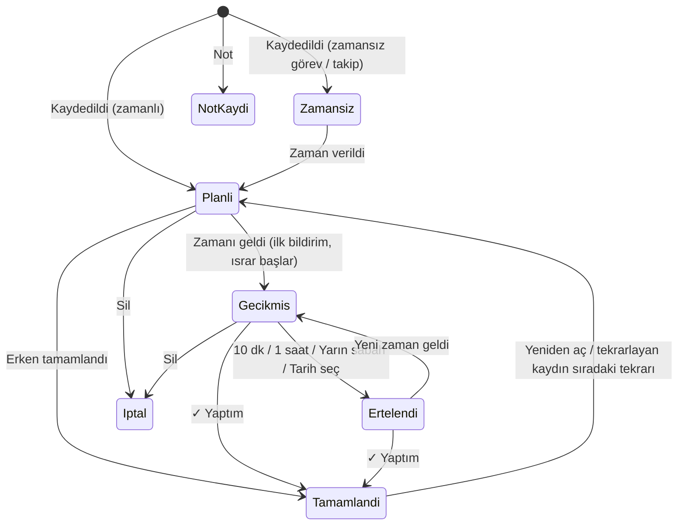
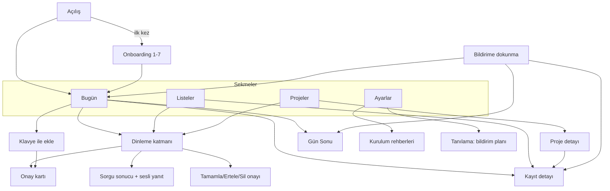

# Asist — Ürün ve UX Şartnamesi (03)

| Alan | Değer |
|---|---|
| Belge | `docs/design/03_ux_product_spec.md` |
| Sürüm / tarih | 0.1 (taslak) — 27 Eylül 2026, Pazar |
| Kapsam | Ürün davranışı, bilgi mimarisi, ekranlar, ses etkileşimi, "unutmayı önleme" (ısrarlı hatırlatma) sistemi, görsel sistem, Türkçe metinler, widget/kontroller, uç durumlar, kabul kriterleri |
| Kapsam dışı | Veri modeli ve depolama ayrıntısı, Türkçe ayrıştırıcı algoritması, derleme/CI, imzalama/yükleme. Bunlar diğer tasarım belgelerindedir. Bu belge o konularda yalnızca **UX beklentisini** tanımlar. |
| Hedef cihaz | iPhone 14 Pro Max (Action Button yok, Dynamic Island var, Apple Intelligence yok), iOS 26 kurulu, dağıtım hedefi **iOS 17.0** |
| Dağıtım | GitHub Actions ile imzasız .ipa, Windows'tan Sideloadly + **ücretsiz Apple ID** (7 günlük imza) |
| Dil | Arayüz ve ses %100 Türkçe. Kod tanımlayıcıları ASCII/İngilizce. |
| Çelişki kuralı | Platform kısıtı ve "ilk seferde derlenme" hedefi bu belgedeki bir UX isteğinden önce gelir. Mimari belgesiyle kimlik/isim farkı varsa mimari belgesi geçerlidir; bu belgedeki kimlikler (bildirim kategorileri, derin bağlantılar, ayar anahtarları) **öneri**dir. |

### Terimler

| Terim | Anlamı |
|---|---|
| Kayıt | Uygulamadaki her öğe (Item). Türü: Hatırlatma, Görev, Not, Takip. |
| Hatırlatma | Belirli bir anda bildirim çalan kayıt ("salı 15:00'te teklif"). |
| Görev | Yapılacak iş. Tarihi ve saati olabilir ya da olmayabilir. Tarihli görev de bildirim alır. |
| Not | Bilgi. Bildirim almaz, gecikmez. Genellikle bir projeye bağlıdır. |
| Takip | Başkasından beklenen iş ("Mehmet cuma I/O listesini gönderecek"). Belirlenen günde "Geldi mi?" diye sorar. |
| Israr (nag) | Kullanıcı "✓ Yaptım" diyene kadar tekrar eden hatırlatma zinciri. |
| Israr profili | Önceliğe göre tekrar aralıkları: Nazik (Normal), Israrcı (Önemli), Bırakmaz (Kritik). |
| Brifing | Sabah özet bildirimi ve istenirse sesli okunan günlük gündem. |
| Gün sonu | Mesai bitiminde açık kalan işlerin gözden geçirilmesi. |
| Onay kartı | Sesli kayıttan sonra "anladığım bu" diye açılan, düzenlenebilir alt sayfa. |
| Tetikleyici | Dinlemeyi başlatan yol (ses tuşu, Siri, Arkaya Dokunma, kilit ekranı kontrolü, widget, uygulama içi mikrofon). |
| Planlayıcı | Bekleyen yerel bildirimleri hesaplayan bileşen (NotificationPlanner). |
| Akıllı Mod | İsteğe bağlı, kullanıcının kendi Claude API anahtarıyla çalışan bulut desteği. Varsayılan: kapalı. |

---

## 1. Kullanıcı ve bağlam

**Kullanıcı:** Fabrika otomasyonu projeleri yöneten bir otomasyon müdürü (PLC/robot hücreleri, devreye alma, FAT/SAT, tedarikçi ve ekip takibi, müşteri toplantıları, saha ziyaretleri, telefon görüşmeleri). Aynı anda çok sayıda konuyla uğraşıyor, kendini unutkan olarak tanımlıyor, telefona hatırlatıcı yazacak zamanı çoğu zaman olmuyor. Alarm çaldığında o an meşgulse alarmı kapatıyor, sonra konuyu tamamen unutuyor.

### 1.1 Günden kesitler (tasarımın test sahneleri)

| # | Sahne | Kısıt | Asist'in cevabı |
|---|---|---|---|
| S1 | Sahada, pano önünde, bir elde laptop. Tedarikçiden gelecek sürücü aklına geliyor. | Tek el, eldiven olabilir, gürültü | Yan tuşa basılı tut → "Asist'e kaydet" → "Ahmet perşembeye kadar sürücüleri gönderecek" → Takip olarak kaydedilir, Siri "Tamam, perşembe günü takip edeceğim" der. Telefonun kilidini açmak gerekmez. |
| S2 | Müşteri toplantısında aklına bir iş geliyor. | Konuşamaz | Uygulamayı açar, **Yaz**'a dokunur, "yarın 10 teklif revizyonu" yazar; kart canlı olarak "Yarın 10:00" gösterir, 4 sn sonra kendiliğinden kaydeder. |
| S3 | FAT sırasında 15:00 bildirimi geliyor; o an meşgul, bildirimi kaydırıp kapatıyor. | Dikkat başka yerde | Hiçbir şey kaybolmaz: 15:05, 15:20, 15:35'te yeniden hatırlatır. 16:00'da "1 saat" der; 17:00'de "✓ Yaptım" der. |
| S4 | Arabada, sabah fabrikaya giderken. | Ekrana bakamaz | 08:00 brifing bildirimi gelir; "Hey Siri, Asist bugün ne var" der → Siri gündemi okur (araç/kulaklık üzerinden de). |
| S5 | Akşam evde, gün bitti ama üç iş açık kaldı. | Yorgun | 17:45 "Gün sonu — 3 iş açık kaldı" → tek dokunuşla **Hepsini yarına taşı**. |
| S6 | Her pazartesi haftalık raporu unutuyor. | Tekrar | "Her pazartesi 9'da haftalık raporu hatırlat" → tekrarlayan hatırlatma. |

### 1.2 Sorun → tasarım cevabı

| Sorun | Tasarım cevabı |
|---|---|
| Hatırlatıcı girmeye vakit yok | Sesle, kalıpsız, 3 saniyede kayıt; uygulama kapalıyken Siri ile kayıt |
| Alarmı kapatıp unutuyor | Kapatma ≠ tamamlama. "✓ Yaptım" diyene kadar önceliğe göre artan ısrar |
| Çok konu, karışıyor | Projeler, Takip listesi, sabah brifingi, gün sonu |
| Alarmdan bıkma riski | Sessiz saatler, mesai farkındalığı, günlük üst sınır, toplu hatırlatma, ertelemeyi akıllı dil |
| Veri kaybı korkusu | Her değişiklik anında diske; uygulama kapanması / yeniden başlatma veri sildirmez; yedek/dışa aktarma |

---

## 2. Yol gösterici ilkeler

Her ilke ölçülebilir bir hedefe bağlıdır; kabul kriterleri (Bölüm 10) bu hedefleri test eder.

1. **3 saniyede yakala.** Uygulama ön plandayken tetikten "Dinliyorum…" durumuna geçiş ≤ 1 sn. Konuşma bitince onay kartı ≤ 0,5 sn içinde görünür. Toplam kayıt süresi (konuşma hariç) ≤ 3 sn.
2. **Sıfır yazma.** Her akış klavyesiz tamamlanabilir. Klavye yalnızca yedek yoldur.
3. **Hiçbir şey kaybolmaz.** Söylenen her şey bir kayda dönüşür; anlaşılamasa bile ham cümle "Kontrol et" işaretiyle saklanır. Yalnızca açık "Vazgeç" siler; kartı kaydırıp kapatmak, uygulamadan çıkmak, gelen arama kaydetmeyi engellemez. Silme her zaman "Geri Al" ile geri alınabilir.
4. **Saygılı ısrar.** Kapatılan bildirim geri gelir; ama gece susar, mesaiyi bilir, günlük üst sınırı vardır, aynı anda birden çok işi tek bildirimde toplar ve kullanıcı erteledikçe dilini yumuşatıp "yeni gün seç" önerir.
5. **Bir bakışta durum.** Ana ekranın üst yarısı, rozet sayısı ve widget'lar şu üç soruya ≤ 2 sn'de cevap verir: *Geciken var mı? Bugün ne var? Sıradaki ne?*
6. **Tek el.** Birincil eylemler ekranın alt %40'ında (6,7" ekranda başparmak alanı). Üst bölüm yalnızca bilgi içindir.
7. **Büyük hedefler.** Mikrofon 88 pt, birincil butonlar ≥ 56 pt yükseklik, tüm dokunma hedefleri ≥ 44×44 pt, satır yüksekliği ≥ 64 pt.
8. **Doğal Türkçe.** "Tamam, salı saat on beşte hatırlatacağım." Ekler (15'te, 9'da) doğru; resmi değil, kısa ve samimi ama laubali olmayan ton. Ekranda sayıdan sonra çoğul yok ("3 iş", "5 hatırlatma").
9. **Anladığını göster, düzeltmeyi tek dokunuşa indir.** Onay kartı göreli günü ve mutlak tarihi birlikte gösterir; her alan tek dokunuşla değişen çiplerle düzeltilir.
10. **Dürüst sınırlar.** iOS'un izin vermediği şeyler (arka planda ses tuşu, ücretsiz imzada kritik alarm) gizlenmez; en iyi alternatif gösterilir.
11. **Cihaz içi öncelikli.** Temel her şey internetsiz çalışır. Akıllı Mod isteğe bağlıdır ve yalnızca kullanıcı açtığında veri gönderir.

---

## 3. Unutmayı önleme sistemi

Asist'in çekirdeği budur. Hedef: kullanıcı bir kaydı ya **tamamlar** ya **bilinçli olarak yeni zamana taşır** ya da **siler**. Bildirimi kaydırıp kapatmak bu üçünden biri değildir.

### 3.1 Kayıt yaşam döngüsü



Kurallar:
- **Gecikmiş** = etkin zamanı (erteleme varsa erteleme zamanı) geçmiş, tamamlanmamış Hatırlatma/Görev. Saatsiz tarihli görev, tarihi geçtiği gün sonunda (23:59) gecikmiş sayılır. Takip, soru gününden 1 gün sonra gecikmiş sayılır. Not asla gecikmez.
- İlk 5 dakikada kayıt "Şimdi" etiketiyle, sonra "X dk gecikti / X saat gecikti / X gündür bekliyor" etiketiyle gösterilir.
- **Etkinlik** niteliğindeki kayıtlar (toplantı, görüşme, randevu, ziyaret, uçuş kelimeleri) ısrar almaz: ön uyarı + başlangıç anı bildirimi alır, başlangıçtan 2 saat sonra kendiliğinden "geçti" olarak kapanır (Tamamlananlar'da "otomatik kapandı" notuyla görünür). (P1 — bkz. Bölüm 6.)
- Tekrarlayan kayıtta "✓ Yaptım" yalnızca o tekrarı kapatır; sıradaki tekrar planlanır.

### 3.2 Bildirim anatomisi

**İçerik bildirimin en görünür yerindedir.** Başlık her zaman kaydın kendisidir; uygulama adı veya "Hatırlatma" kelimesi başlıkta yer almaz.

```
┌───────────────────────────────────────────────┐
│ [A] ASIST                               şimdi │
│ Teklif konusu                                 │  ← BAŞLIK: kaydın başlığı (≤ 60 karakter)
│ Salı 15:00 · Kocaeli Hattı · Önemli           │  ← ALT BAŞLIK: zaman · proje · öncelik
│ "Salı günü teklif konusunu bana saat 3'te     │  ← GÖVDE: kullanıcının kendi cümlesi
│  hatırlat"                                    │     (varsa kayıt notu, ilk 2 satır)
├───────────────────────────────────────────────┤  (basılı tutunca / aşağı çekince)
│ ✓ Yaptım                                      │
│ 10 dk                                         │
│ 1 saat                                        │
│ Yarın sabah                                   │
└───────────────────────────────────────────────┘
```

| Bildirim türü | Başlık | Alt başlık | Gövde |
|---|---|---|---|
| İlk hatırlatma | `{başlık}` | `{zaman} · {proje} · {öncelik≠Normal}` | Orijinal cümle veya not |
| Israr (2., 3. …) | `{başlık}` (aynı) | `{N} dakikadır bekliyor · {k}. hatırlatma` (Kritikte başa `KRİTİK · `) | Orijinal cümle |
| 3+ kez ertelenmiş | `{başlık}` | `{n}. kez ertelendi — bugün olmayacaksa yeni gün seç` | Orijinal cümle |
| Günün son ısrarı | `{başlık}` | `Bugünlük son hatırlatma — yarın sabah brifingde tekrar göreceksin` | — |
| Ön uyarı (P1) | `{süre} sonra: {başlık}` | `{zaman} · {proje}` | — |
| Takip | `Takip · {kişi}: {konu}` | `Geldi mi? Son tarih: {gün}` | Orijinal cümle |
| Toplu ısrar (P1) | `{n} iş seni bekliyor` | `En eskisi: {başlık}` | Başlıklar, virgülle, en fazla 4 |

Kurallar:
- `threadIdentifier` = kayıt kimliği → aynı kaydın bildirimleri Bildirim Merkezi'nde tek yığında toplanır.
- Kayıt tamamlandığında/ertelendiğinde o kaydın **teslim edilmiş** bildirimleri de Bildirim Merkezi'nden temizlenir (eski ısrarlar kafa karıştırmasın).
- `interruptionLevel` ve `relevanceScore`:

| Kaynak | interruptionLevel | relevanceScore | Ses |
|---|---|---|---|
| Normal kayıt | `.active` | 0,5 | Varsayılan |
| Önemli kayıt | `.timeSensitive` | 0,8 | Varsayılan (P1: "ısrarlı" özel ses) |
| Kritik kayıt | `.timeSensitive` | 1,0 | Varsayılan (P1: "kritik" özel ses) |
| Sabah brifingi / Gün sonu | `.active` | 0,6 | Varsayılan |
| Haftalık özet (P1) | `.passive` | 0,3 | Yok |
| Arka plan eylemi geri bildirimi ("3 iş taşındı") | `.passive` | 0,1 | Yok |
| İmza bitiş uyarısı (T-24 sa, T-3 sa) | `.timeSensitive` | 0,9 | Varsayılan |

> Not: `.timeSensitive` yetkisi (entitlement) ücretsiz imzada yoksa sistemin bildirimi normal düzeyde teslim etmesi beklenir (ilk cihaz testinde doğrulanacak: Ayarlar > Bildirimler > Asist'te "Zamana Duyarlı" anahtarı görünüyorsa yetki etkindir). Hiçbir davranış bu yetkiye **bağımlı değildir**. Kritik uyarı (Critical Alert) ücretli ve Apple onaylı olduğundan kullanılmaz.

### 3.3 Bildirim eylemleri

iOS'ta tüm sürümlerde eksiksiz görünmesi için bir kategoride **en fazla 4 eylem** kullanılır. Bildirimin gövdesine dokunmak her zaman uygulamayı ilgili kaydın detayında, geniş erteleme seçenekleriyle açar ("Ertele…" işlevi budur).

| Kategori (öneri) | Eylem kimliği (öneri) | Başlık | SF Symbol | Çalışma | Davranış |
|---|---|---|---|---|---|
| `ASIST_KAYIT` | `ASIST_YAPTIM` | ✓ Yaptım | `checkmark.circle.fill` | Arka plan | Tamamlar; kaydın bekleyen tüm bildirimlerini iptal eder, teslim edilmişleri temizler, rozeti ve widget'ları günceller; tekrarlıysa sıradakini planlar. |
| | `ASIST_ERTELE_10DK` | 10 dk | `clock` | Arka plan | Etkin zamanı şimdi+10 dk yapar; ısrar zinciri o andan yeniden başlar. |
| | `ASIST_ERTELE_1SA` | 1 saat | `clock.arrow.circlepath` | Arka plan | Şimdi+60 dk. |
| | `ASIST_ERTELE_YARIN` | Yarın sabah | `sunrise` | Arka plan | Yarın mesai başlangıcı (yarın iş günü değilse "sabah" varsayılanı 09:00). Saat 05:00'ten önce basılırsa **bugünün** sabahı. |
| `ASIST_TAKIP` | `ASIST_TAKIP_GELDI` | ✓ Geldi | `checkmark.circle.fill` | Arka plan | Takibi tamamlar. |
| | `ASIST_TAKIP_YARIN` | Yarın tekrar sor | `arrow.uturn.forward` | Arka plan | Yarın takip soru saatinde tekrar sorar. |
| | `ASIST_TAKIP_2GUN` | 2 gün sonra | `calendar` | Arka plan | 2 iş günü sonra. |
| | `ASIST_TAKIP_MESAJ` | Mesaj gönder… | `paperplane` | Ön plan | Uygulamayı açar, hazır takip mesajıyla paylaşım sayfasını gösterir (WhatsApp, e-posta, SMS; bkz. 4.8). |
| `ASIST_BRIFING` | `ASIST_BRIFING_OKU` | Sesli oku | `speaker.wave.2.fill` | Ön plan | Uygulamayı Bugün ekranında açar ve gündemi okur. |
| `ASIST_GUNSONU` | `ASIST_GUNSONU_TASI` | Hepsini yarına taşı | `arrow.right.circle.fill` | Arka plan | Bkz. 3.10. Ardından sessiz bir onay bildirimi gönderir. |
| | `ASIST_GUNSONU_GOZDEN` | Gözden geçir | `list.bullet` | Ön plan | Gün Sonu ekranını açar. |
| `ASIST_SISTEM` | — | — | — | — | İmza uyarısı, "Asist'i bir kez aç" hatırlatması, test bildirimi. Dokununca ilgili ekranı açar. |

- Hiçbir bildirim eyleminde "Sil" yoktur (kilit ekranından yanlışlıkla veri kaybı olmasın).
- "✓ Yaptım" ve ertelemeler kilit açmadan çalışır (`authenticationRequired` yok). Bunun için veri dosyası "ilk kilit açılışından sonra erişilebilir" koruma sınıfında olmalıdır (bkz. 3.14).
- Kategoriye `customDismissAction` eklenmesi önerilir: kullanıcı kaydırıp kapattığında uygulama kısa süre uyanırsa ısrar zincirini uzatır. **Ama hiçbir davranış buna dayanmaz;** ısrar zinciri her zaman önceden planlanmıştır.

### 3.4 Israr (nag) profilleri

Varsayılan profil önceliğe göre seçilir; kayıt detayından tek kayıt için değiştirilebilir. Aralıklar **ilk bildirimden itibaren** ölçülür.

| Profil | Varsayılan öncelik | Aynı gün tekrarları | Tekrar aralığı (listeden sonra) | Ertesi günler | Günlük üst sınır (ilk bildirim dahil) | Kayıt başına planlı ısrar sınırı (ilk bildirim hariç) |
|---|---|---|---|---|---|---|
| **Nazik** | Normal | +10 dk, +30 dk, +2 sa | — (liste bitince durur) | Günde 1 kez: iş günü mesai başı, değilse 09:00 | 4 | 3 |
| **Israrcı** | Önemli | +5, +15, +30, +60 dk | Mesai içinde her 1 saat, mesai dışında her 2 saat | Mesai başı + mesai içinde her 2 saat | 10 | 6 |
| **Bırakmaz** | Kritik | +2, +5, +10, +15 dk | Her 15 dk | Mesai başı + her 30 dk | 30 | 10 |

Kurallar:
1. **Sessiz saatler** (varsayılan 22:30–07:30) içinde ısrar çalmaz; o aralığa düşen tekrarlar tek bir tekrara indirgenip sessiz saat bitimine kaydırılır. İstisna: kullanıcının **açıkça** o saat için kurduğu ilk bildirim ("gece 2'de sunucu yedeğini kontrol et") ve açıkça seçtiği erteleme her zaman çalar. Ayar: "Kritik işler sessiz saatte de ısrar etsin" (varsayılan **kapalı**).
2. **Günlük üst sınıra** ulaşılınca o günün son bildirimi "Bugünlük son hatırlatma" metnini taşır; kayıt ertesi gün brifingde ve ertesi gün ısrar kuralına göre döner.
3. Etkinlik kayıtları ısrar almaz (3.1). Notlar hiç bildirim almaz.
4. Takip ısrarı ayrıdır ve nazik: soru anında 1 kez, sonra her iş günü takip soru saatinde 1 kez ("2. kez soruyorum" alt başlığıyla) — tamamlanana veya kullanıcı ertelemeye kadar.
5. **"Sessize al"** (P1, Bugün ekranı araç çubuğu): 30 dk / 1 saat / 2 saat / Mesai sonuna kadar. Bu süredeki ısrarlar süre sonuna toplanır (tek toplu bildirim). Kritik kaydın **ilk** bildirimi yine çalar.
6. Profil düzenleyici, zaman çizelgesi önizlemesi gösterir: `15:00 · 15:05 · 15:15 · 15:30 · 16:00 · sonra saatte bir (mesai içinde)`.

### 3.5 Mesai farkındalığı

Varsayılanlar: iş günleri Pazartesi–Cuma (Cumartesi seçilebilir), mesai 08:30–18:00.

- "Yarın sabah" = yarın mesai başlangıcı (yarın iş günü değilse 09:00).
- Israrcı profilde mesai dışında tekrar aralığı iki katına çıkar (1 sa → 2 sa).
- Önceki günlerden taşan (gecikmiş) kayıtların ertesi gün ilk hatırlatması: iş günü ise mesai başı, değilse 09:00.
- Sabah brifingi, gün sonu, takip soruları varsayılan olarak yalnız iş günlerinde çalışır (ayar ile hafta sonu açılabilir).
- Hafta sonuna düşen iş kaydında onay kartı "Bu tarih hafta sonuna denk geliyor" ipucu ve **Pazartesiye al** çipi gösterir (otomatik değiştirmez).

### 3.6 Erteleme anlamları

| Seçenek | Hedef zaman | Not |
|---|---|---|
| 10 dk | Şimdi + 10 dk | Mutlak süre (saat dilimi değişse de 10 dk). |
| 30 dk (uygulama içi) | Şimdi + 30 dk | |
| 1 saat | Şimdi + 60 dk | |
| 2 saat (uygulama içi) | Şimdi + 120 dk | |
| Bu akşam (uygulama içi) | Bugün 19:00; saat 18:30'u geçtiyse gizlenir | |
| Yarın sabah | Bkz. 3.3 | |
| Pazartesi (uygulama içi) | Önümüzdeki pazartesi mesai başı | Bugün pazartesiyse bir sonraki. |
| Tarih seç… | Takvim + saat seçici | |

- Erteleme sonrası ısrar zinciri **yeni zamandan** yeniden başlar, profil değişmez.
- Erteleme sayısı kayıtta tutulur; 3. ertelemeden itibaren bildirim dili değişir (3.2) ve uygulama içi erteleme sayfası en üstte "Yeni gün seç" önerir.
- Açık erteleme sessiz saate düşse bile çalar (kullanıcının bilinçli seçimi); ondan sonraki ısrarlar sessiz saate uyar.

### 3.7 Örnek zaman çizelgesi (Önemli, Israrcı profil)

"Salı günü teklif konusunu bana saat 3'te hatırlat" → 29 Eylül Salı 15:00.

| Saat | Olay | Sonuç |
|---|---|---|
| 15:00 | İlk bildirim (zamana duyarlı) | Kullanıcı FAT'ta; bildirimi kaydırıp kapatır. **Hiçbir şey değişmez.** |
| 15:05 | 2. hatırlatma: "5 dakikadır bekliyor · 2. hatırlatma" | Görmez. |
| 15:15 | 3. hatırlatma | Kullanıcı "1 saat"e basar → zincir iptal, yeni zincir 16:15'ten. |
| 16:15 | İlk bildirim (erteleme sonrası) | Kapatır. |
| 16:20 | 2. hatırlatma | "✓ Yaptım" → tüm bekleyenler iptal, Bildirim Merkezi temizlenir, rozet −1. |

### 3.8 Gecikenlerin öne çıkması ve rozet

- Bugün ekranında **Gecikenler** her zaman en üsttedir; en öncelikli ve en eski geciken "Şimdi ilgilen" kartı olarak büyütülür (4.3).
- Uygulama simgesi rozeti = **gecikmiş kayıt sayısı** (varsayılan). Ayar: "Geciken" / "Geciken + bugün kalan" / "Kapalı".
- Uygulama çalışmıyorken bir kaydın gecikmeye başlaması rozeti değiştiremeyeceği için, planlayıcı her bildirimin `badge` değerini **o bildirimin çalacağı andaki** beklenen geciken sayısıyla önceden hesaplar. Uygulama her açıldığında/uyandığında rozet gerçek değere eşitlenir.

### 3.9 Sabah brifingi

- Varsayılan: iş günleri 08:00 (ayarlanabilir). Hafta sonu: kapalı (ayar).
- Başlık: `Günaydın — bugün 5 iş`
- Gövde: `2 gecikmiş · 1 takip · İlk: 09:30 Ahmet'i ara`
- Hiç iş ve geciken yoksa **gönderilmez** (ayar: "Boş günlerde de gönder", varsayılan kapalı).
- İçerik, bildirimin **çalacağı ana göre** hesaplanır ve her veri değişikliğinde yeniden planlanır; böylece uygulama arada hiç açılmasa da brifing doğru olur (zamanla geciken kayıtlar önceden bilinebilir).
- Eylem: **Sesli oku** → uygulama açılır, Bugün ekranı gösterilir ve gündem okunur (bkz. 5.9). Gövdeye dokunmak sadece Bugün ekranını açar; ayarda "Brifinge dokununca sesli oku" açıksa okur.
- Yalnızca sıradaki 2 brifing planlanır (içerik güne göre değiştiği için tekrarlayan tetik kullanılmaz).

### 3.10 Gün sonu gözden geçirme

- Varsayılan: iş günleri 17:45 (mesai bitişi − 15 dk). Yalnızca bugün için açık kayıt veya geciken varsa gönderilir.
- Başlık: `Gün sonu — 3 iş açık kaldı`
- Gövde: `Yarına taşıyayım mı? Teklif konusu, Ahmet'i ara, +1`
- Eylemler: **Hepsini yarına taşı** (arka plan), **Gözden geçir** (Gün Sonu ekranı).
- **Hepsini yarına taşı** kuralları:
  - Kapsam: bugün tarihli açık Hatırlatma/Görev/Takip + tüm gecikmişler. Notlar, tekrarlayanlar (kendi sıradaki tekrarı vardır) ve etkinlikler hariç.
  - Saati olanlar yarın **aynı saate**; saatsizler yarın saatsiz görev olarak taşınır. Yarın iş günü değilse sonraki iş günü (ayar: "Hafta sonuna taşıma", varsayılan açık = iş gününe taşı).
  - Öncelik ve proje korunur; kayıt geçmişine "Gün sonunda yarına taşındı" yazılır.
  - Sonra sessiz bildirim: `3 iş yarına taşındı. Geri almak için dokun.` Dokununca uygulama "Geri Al" seçeneğiyle açılır. Uygulama bir sonraki açılışta da 24 saat boyunca üstte `Dün 3 iş bugüne taşındı — Geri Al` bandını gösterir.
- Gün Sonu ekranı (4.10) tek tek karar için kart kart ilerler.

### 3.11 Haftalık özet (P1)

- Cuma 17:30 (ayarlanabilir): `Haftanın özeti` / `18 iş tamamlandı · 4 takip bekliyor · 2 geciken`.
- Dokununca Haftalık Özet ekranı: tamamlananlar (proje bazında sayı), açık takipler, gelecek haftanın ilk 5 işi. Akıllı Mod açıksa "Haftalık rapor taslağı hazırla" butonu (P2).

### 3.12 Bildirim yorgunluğuna karşı önlemler

| Önlem | Öncelik | Açıklama |
|---|---|---|
| Önceliğe göre profil | P0 | Normal işler en fazla 4 kez/gün. |
| Sessiz saatler | P0 | Gece ısrar yok. |
| Günlük üst sınır + "bugünlük son" metni | P0 | Sonsuz döngü hissi yok. |
| Tek yığın (thread) + teslim edilenleri temizleme | P0 | Bildirim Merkezi dolup taşmaz. |
| Ertelemeye duyarlı dil | P0 | 3. ertelemede "yeni gün seç". |
| Boş brifing göndermeme | P0 | |
| Toplu ısrar | P1 | Aynı 10 dakikalık pencereye düşen 2+ kaydın **ısrarları** tek bildirimde birleşir ("3 iş seni bekliyor"). İlk bildirimler her zaman tekil kalır. Eylemler: "Göster", "Hepsi 1 saat sonra". |
| Sessize al (toplantıdayım) | P1 | 3.4 kural 5. |
| Özel, ayırt edici sesler | P1 | Nazik / ısrarlı / kritik; ≤ 30 sn `.caf`/`.wav`. Yüksek sesli değil, **farklı**. |
| Odak modu rehberi | P0 | Onboarding'de "İş" odağına Asist'i ekleme önerisi. |

### 3.13 64 bildirim sınırı ve planlama bütçesi

iOS bir uygulama için en yakın **64** bekleyen yerel bildirimi tutar, fazlasını sessizce atar. Israr zincirleri bu sınırı hızla tüketebileceğinden planlayıcı bir **bütçe** uygular:

1. **Ayrılmış yuvalar (en fazla 8):** sıradaki 2 sabah brifingi, sıradaki gün sonu, haftalık özet (P1), haftalık yedek hatırlatması, imza uyarıları (en fazla 2), "Asist'i bir kez aç" yenileme bildirimi (1).
2. **Kayıt yuvaları (kalan ≥ 56), doldurma sırası:**
   1. Tüm kayıtların **ilk** bildirimleri (ön uyarılar dahil) — zaman sırasıyla.
   2. Israrlar — zaman sırasıyla, kayıt başına profil sınırına (3 / 6 / 10) kadar.
   3. Tekrarlayan kayıtların sonraki 2 tekrarı.
3. Bütçe yetmezse: en uzak olanlar planlanmaz; son planlanan bildirimden hemen sonrası için **yenileme bildirimi** kurulur: `Asist'i bir kez aç` / `Yaklaşan hatırlatmaları planlayabilmem için uygulamayı açman yeterli.` Ayarlar > Tanılama'da `Planlanan bildirimler: 57/64` gösterilir; kullanıcıya Bugün ekranında bilgi bandı çıkar.
4. **Yeniden planlama tetikleri:** uygulama açılışı / ön plana gelişi; her veri değişikliği (arayüz, Siri, widget, bildirim eylemi, derin bağlantı); önemli zaman değişikliği (gece yarısı, saat/saat dilimi değişimi); fırsat buldukça arka plan yenileme (`BGAppRefreshTask`, garanti değil). Kullanıcı bildirimle her etkileştiğinde uygulama uyandığı için zincir kendiliğinden uzar.
5. Planlayıcı **saf bir fonksiyon** olarak tasarlanmalıdır (girdi: kayıtlar + ayarlar + şimdi; çıktı: planlanacak bildirim listesi). Böylece AsistCore paketinde Linux'ta birim testiyle doğrulanabilir. (Öneri; kesin yer mimari belgesindedir.)

### 3.14 UX vaatlerinin teknik ön koşulları (uygulayıcıya not)

Bu maddeler karşılanmazsa yukarıdaki davranışlar sahada sessizce bozulur:

| Vaat | Ön koşul |
|---|---|
| Uygulama kapalıyken hatırlatma | Yalnızca yerel bildirim (`UNCalendarNotificationTrigger` / `UNTimeIntervalNotificationTrigger`). Push yok. |
| Kilit ekranından "✓ Yaptım" | Bildirim merkezi delegesi uygulama başlatılırken (ilk satırlarda) atanmalı; veri dosyası `completeUntilFirstUserAuthentication` koruma sınıfında olmalı; eylem arka planda biterken değişiklik diske yazılmış olmalı. |
| Kilitliyken Siri ile kayıt | Kayıt intent'i uygulamayı açmadan çalışmalı ve kilitliyken izinli olmalı; veri dosyası yukarıdaki koruma sınıfında olmalı. |
| Tamamlayınca bildirimlerin kesilmesi | Her kaydın bildirim kimlikleri kayıt kimliğinden türetilmeli (ör. `item-<uuid>-n<k>`) ki önek ile toplu iptal yapılabilsin. |
| Duvar saati davranışı | "Saat 15'te" gibi kayıtlar saat dilimine bağlı olmayan takvim bileşenleriyle planlanır (seyahatte yerel 15:00'te çalar); "10 dk sonra" gibi göreli kayıtlar mutlak süreyle planlanır. |
| Uygulama kapanınca veri kaybı olmaması | Her değişiklik anında ve atomik yazılır; ertelenmiş "sonra kaydet" yoktur. |

---

## 4. Bilgi mimarisi ve ekranlar

### 4.1 Gezinme kararı

**Karar:** 4 sekmeli standart SwiftUI `TabView` + her ekranda başparmak erişimindeki mikrofon.

| Sekme | Simge | İçerik |
|---|---|---|
| **Bugün** | `sun.max.fill` | Ana ekran: gecikenler, bugün, yaklaşan, dev mikrofon |
| **Listeler** | `list.bullet` | Hatırlatmalar / Görevler / Notlar / Takip / Tamamlananlar + arama |
| **Projeler** | `folder.fill` | Projeye göre gruplanmış kayıtlar, proje notları |
| **Ayarlar** | `gearshape.fill` | Tüm ayarlar, rehberler, yedek, tanılama |

Gerekçe:
- Kullanıcının %90 kullanımı "kaydet" ve "bugüne bak"tır; ikisi de Bugün sekmesindedir ve uygulama her açılışta orada başlar (derin bağlantı yoksa).
- Tek ekranlı (sekmesiz) tasarım Projeler ve Takip gibi ikinci seviye ihtiyaçları gömer; 5+ sekme ise dikkati dağıtır.
- Ortası yükseltilmiş özel sekme butonu **kullanılmaz**: iOS 26 Liquid Glass sekme çubuğuyla uyumsuzluk ve derleme/yerleşim riski. Mikrofon, sekme çubuğunun üstünde içerik alanına yerleşir (`safeAreaInset(edge: .bottom)`).
- iOS 17 uyumu için sekmeler klasik `.tabItem` ile tanımlanır (yeni `Tab` API'si iOS 18+). Yeni SDK'da çıkabilecek kullanım dışı (deprecation) uyarıları kabul edilebilir.

Mikrofon yerleşimi:
- **Bugün:** alt çubuğun ortasında 88 pt dev mikrofon, solunda 56 pt **Yaz**, sağında 56 pt **Oku**.
- **Listeler / Projeler:** sağ altta 64 pt yüzen mikrofon (FAB). Projeler içindeyken kayıt o projeye bağlanır.
- **Ayarlar:** mikrofon yok.

### 4.2 Ekran haritası



### 4.3 Bugün ekranı

```
┌─────────────────────────────────────────────┐
│ 27 Eylül Pazar          [ay] [sessize al]   │  araç çubuğu: Gün Sonu, Sessize al (P1)
│ Günaydın, Gökhan                            │  largeTitle (hitap ayarlardan)
│ ( 2 geciken ) ( 5 bugün ) ( 3 takip )       │  sayaç çipleri — dokununca filtre
├─────────────────────────────────────────────┤
│ ! Bildirimler kapalı — hatırlatmalar        │  koşullu uyarı bandı (Bölüm 9)
│   çalmayacak.              [Ayarları Aç]    │
├─────────────────────────────────────────────┤
│ GECİKENLER                                  │
│ ┌─────────────────────────────────────────┐ │  "Şimdi ilgilen" kartı
│ │▌[zil] Teklif konusu            ÖNEMLİ   │ │
│ │▌ 15:00 · 2 saat gecikti · Kocaeli Hattı │ │
│ │ [ ✓ Yaptım ][ 10 dk ][ 1 saat ][ Yarın ]│ │  56 pt butonlar
│ └─────────────────────────────────────────┘ │
│ ▌[kum] Takip · Mehmet: I/O listesi      (○) │  normal satır, 64 pt
├─────────────────────────────────────────────┤
│ BUGÜN                                       │
│ ▌[zil] 14:00  ABB toplantısı            (○) │
│ ▌[✓]  Gün içinde · Sipariş formu        (○) │
├─────────────────────────────────────────────┤
│ YAKLAŞAN                                    │
│  Yarın                                      │
│ ▌[zil] 09:00  Haftalık rapor  [tekrar]  (○) │
│  Salı                                       │
│ ▌[zil] 15:00  Teklif revizyonu          (○) │
│               Tümünü göster (7)             │
├─────────────────────────────────────────────┤
│ Zamanı belirsiz (3)                       > │
│ Bu hafta 12 iş bitti                        │  küçük, ikincil
├─────────────────────────────────────────────┤
│   [ Yaz ]       (  MİKROFON  )     [ Oku ]  │  sabit alt bölge
├─────────────────────────────────────────────┤
│  Bugün    Listeler    Projeler    Ayarlar   │
└─────────────────────────────────────────────┘
```

Bölümler ve sıralama:

| Bölüm | İçerik | Sıralama | Renk |
|---|---|---|---|
| Uyarı bandı | İzin/imza/veri/bütçe uyarıları (Bölüm 9), en fazla 1 tane görünür (en önemlisi), diğerleri Ayarlar'da | Önem | Kırmızı/sarı |
| Gecikenler | Gecikmiş Hatırlatma/Görev/Takip. İlki büyük kart. Boşsa bölüm gizlenir. | Önce öncelik (Kritik→Normal), sonra en eski | Kırmızı |
| Bugün | Bugün etkin zamanı gelecekte olanlar + bugünün saatsiz görevleri ("Gün içinde", en sonda) + bugünün takipleri | Saate göre | Turuncu |
| Yaklaşan | Önümüzdeki 7 gün, gün başlıklarıyla; ilk 5 satır, sonra "Tümünü göster (n)" | Tarihe göre | Mavi |
| Zamanı belirsiz | Tarihsiz görev/takip sayısı; dokununca liste + "Planla" | — | Gri |
| Haftalık sayaç | "Bu hafta 12 iş bitti" | — | Gri |

- Sayaç çiplerine dokunmak Listeler sekmesini ilgili filtreyle açar.
- Satırdaki `(○)` 44 pt tamamlama düğmesidir: dokununca üstü çizilir, 0,4 sn sonra listeden çıkar, alt kısımda `Tamamlandı — Geri Al` (5 sn) görünür. Tekrarlayan kayıtta toast: `Bu seferlik tamamlandı · Sıradaki: Pzt 09:00`.
- Satır kaydırma: sağa kaydır = **Yaptım** (yeşil), sola kaydır = **Ertele** (turuncu, erteleme menüsü) ve **Sil** (kırmızı, Geri Al ile).
- **Oku:** gündemi sesli okur (5.9). Okurken buton `Durdur` olur.
- **Yaz:** klavyeyle ekleme sayfası (4.6).
- Aşağı çekerek yenileme yok (veri yereldir); ekran her ön plana gelişte ve dakika başında göreli zamanları günceller.
- Boş durum (hiç kayıt yoksa): `ContentUnavailableView` — "Bugün için bekleyen bir şey yok" / "Aklına bir şey gelirse mikrofona dokunman yeterli."

### 4.4 Dinleme katmanı

Ayrıntı Bölüm 5.3'tedir. Tam ekran, koyu yarı saydam arka plan; her tetikleyici aynı katmanı açar.

### 4.5 Onay kartı (sesli kayıt sonrası)

`.sheet` + `presentationDetents([.medium, .large])`, açılışta orta boy.

```
┌─────────────────────────────────────────────┐
│ "Salı günü teklif konusunu bana saat 3'te   │  duyulan cümle (ikincil, italik)
│  hatırlat"                     [Tekrar söyle]│
│                                             │
│ [zil] Hatırlatma                            │
│ Teklif konusu                          [✎]  │  title2, satır içi düzenlenebilir
│ Salı · 15:00                                │  title3, turuncu/mavi (göreli)
│ 29 Eylül · 2 gün sonra                      │  subheadline, ikincil
│                                             │
│ Gün   (Bugün)(Yarın)[Salı](Cuma)(Tarih…)   │  yatay kaydırmalı çipler, 44 pt
│ Saat  (09:00)(12:00)[15:00](18:00)(Saat…)  │
│ Öncelik (Normal)[Önemli](Kritik)            │
│ Tür   [Hatırlatma](Görev)(Not)(Takip)       │
│ Proje (+ Proje)   Tekrar (Yok)   Kişi (—)   │  ikincil satır
│                                             │
│ [   Vazgeç   ]     [  Kaydet  ◔ 4  ]        │  56 pt; halka 4 sn'de dolar
└─────────────────────────────────────────────┘
```

Davranış kuralları:

| Durum | Otomatik kayıt | Görsel | Ses |
|---|---|---|---|
| Yüksek güven, eksik alan yok | 4 sn (ayar: Kapalı/3/4/6) | Kaydet butonunda dolan halka | Kayıttan sonra kısa sesli onay |
| Orta güven | 6 sn | Belirsiz alan noktalı alt çizgi + "?" rozeti (ör. `15:00?`) | Kayıttan sonra sesli onay |
| Düşük güven | Yok | Başlık `Bunu mu demek istedin?`, en iyi tahmin + alternatif çipler (ör. `03:00` / `15:00`), Akıllı Mod açıksa `Akıllı Mod ile anla` | `Emin olamadım, ekrandan kontrol eder misin?` |
| "Hatırlat" dendi ama zaman yok | Yok | "Ne zaman?" satırı turuncu vurgulu: `(1 saat sonra)(Bu akşam)(Yarın sabah)(Zamansız görev)` | `Ne zaman hatırlatayım?` + mikrofon 5 sn kendiliğinden açılır; cevap yalnızca zaman olarak yorumlanır |
| VoiceOver açık | Yok | — | — |

- Karta **herhangi bir dokunuş** geri sayımı durdurur; buton düz "Kaydet" olur.
- **Hiçbir şey kaybolmaz:** kartı aşağı kaydırıp kapatmak, uygulamadan çıkmak, gelen arama = **kaydet** (en iyi tahminle; zamanı eksikse "Zaman söylenmezse" ayarı, varsayılan geri dönüş "1 saat sonra"). Yalnızca **Vazgeç** kaydetmez. Vazgeç'ten sonra da 5 sn `Vazgeçildi — Geri Al` gösterilir.
- Kayıttan sonra kart kapanır, alt kısımda `Kaydedildi · Salı 15:00 — Geri Al` (5 sn) ve `.success` dokunsal geri bildirim.
- Çip değişince başlıktaki göreli metin anında güncellenir.
- Gün çipleri dinamiktir: Bugün, Yarın, ayrıştırılan gün (farklıysa), bir sonraki Pazartesi, `Tarih…`. Saat çipleri: ayrıştırılan saat + 09:00, 12:00, 15:00, 18:00, `Saat…` (tekerlekli seçici). Ayrıştırılan değer seçili (dolu) çiptir.
- Geçmiş zaman söylendiyse ("bugün 9'da" saat 10'da): `Bu saat geçti; yarına ayarladım.` ipucu + `Bugün hemen` çipi.
- Hafta sonu ipucu: 3.5.
- Proje: bilinen proje adı/takma adı geçtiyse çip dolu gelir. "X projesi/projesine/projesinde" kalıbı geçip proje yoksa `Yeni proje: X` çipi dolu gelir ve kayıtla birlikte oluşturulur (çipteki × ile iptal).
- **Tekrar söyle:** dinlemeyi yeniden açar, yeni sonuç kartın içeriğini değiştirir.
- Tek cümlede birden çok kayıt (P1): kart yatay sayfalı olur (`1/2`), "Hepsini kaydet".

### 4.6 Klavye ile ekle ("Yaz")

- Alt sayfa, klavye açık gelir. Çok satırlı metin alanı. Yer tutucu: `Ne hatırlatayım? Örn: Yarın 10'da tedarikçiyi ara`
- Yazdıkça (300 ms gecikmeyle) aynı ayrıştırıcı çalışır, altta canlı önizleme çipleri görünür: `[zil] Hatırlatma · Yarın 10:00 · Tedarikçiyi ara`.
- `Ekle` (56 pt) → Onay kartı adımı atlanır (kullanıcı zaten gördü), doğrudan kaydedilir + Geri Al toast'u. Önizleme düşük güvendeyse `Ekle` yerine `Kontrol et` yazar ve onay kartını açar.
- Klavyenin kendi dikte mikrofonu da kullanılabilir (konuşma tanıma izni verilmediğinde yedek yol).
- Yarım kalan metin taslak olarak saklanır; sayfa tekrar açılınca geri gelir.

### 4.7 Listeler

- Üstte yatay kaydırmalı filtre çipleri (44 pt, sayılı): `Hatırlatmalar (8)` `Görevler (5)` `Notlar (21)` `Takip (3)` `Tamamlananlar`. Seçim hatırlanır.
- `.searchable`: `Ara: başlık, not, kişi, proje`. Arama Türkçe büyük/küçük harf ve aksandan bağımsızdır ("ozet" → "Özet", "IZMIR" → "İzmir"), orijinal cümle ve notlar dahil.
- Araç çubuğu menüsü: `Proje: Tümü ▾`, sıralama (`Zamana göre` / `Önceliğe göre` / `Eklenme sırasına göre`).
- Liste bazında davranış:

| Liste | Gösterilen | Satır ikinci satırı | Boş durum |
|---|---|---|---|
| Hatırlatmalar | Açık, zamanlı kayıtlar | Göreli zaman · proje · tekrar simgesi | `Planlanmış hatırlatma yok.` |
| Görevler | Açık görevler (tarihli üstte, tarihsizler "Zamanı belirsiz" başlığı altında) | Tarih veya "Zamanı belirsiz" · proje | `Açık görev yok.` |
| Notlar | Tüm notlar, yeniden eskiye, proje başlıklarıyla gruplanabilir | İlk satır + tarih | `Henüz not yok. "Not al: …" diyerek başlayabilirsin.` |
| Takip | Açık takipler, kişi adıyla | `Kişi · son tarih · kaç gündür` | `Kimseden bir şey beklemiyorsun.` |
| Tamamlananlar | Son 90 gün (daha eskisi "Daha eski" ile yüklenir) | Tamamlanma zamanı | `Tamamlanan iş yok.` |

- Tamamlananlar'da kaydırma eylemi: `Yeniden aç`.
- Silinen kayıtlar (P1): Ayarlar > Veri > Son silinenler (30 gün). P0'da yalnızca Geri Al toast'u.

### 4.8 Kayıt detayı

```
┌─────────────────────────────────────────────┐
│ <  Hatırlatma                        [•••]  │  menü: Çoğalt, Paylaş, E-posta taslağı (Akıllı Mod), Sil
│ Teklif konusu                               │  title2, düzenlenebilir
│ [!] Önemli · Kocaeli Hattı                  │
├─────────────────────────────────────────────┤
│ ZAMAN                                       │
│ Salı · 15:00            (2 gün sonra)   >   │
│ Ertele: (30 dk)(1 saat)(Bu akşam)(Yarın     │  6 büyük çip (2×3 ızgara)
│          sabah)(Pazartesi)(Tarih seç…)      │
│ Tekrar: Yok                              >  │
│ Ön uyarı: Yok                            >  │  (P1)
│ Israr düzeyi: Israrcı (önceliğe göre)    >  │
├─────────────────────────────────────────────┤
│ Tür (Hatırlatma)  Öncelik (Önemli)          │
│ Proje (Kocaeli Hattı)  Kişi (—)  Yer (—)    │  Yer: P1
├─────────────────────────────────────────────┤
│ NOTLAR                         [mikrofon+]  │  sesle not ekle
│ Revizyon B fiyatları bekleniyor.            │
├─────────────────────────────────────────────┤
│ KONTROL LİSTESİ (P1)                        │
│ (○) Fiyat listesi  (●) Teslim süresi        │
├─────────────────────────────────────────────┤
│ ORİJİNAL CÜMLE                              │
│ "Salı günü teklif konusunu bana saat 3'te   │
│  hatırlat"                                  │
│ GEÇMİŞ                                      │
│ 27 Eyl 10:14 · sesle oluşturuldu            │
│ 29 Eyl 15:15 · ertelendi → 16:15            │
├─────────────────────────────────────────────┤
│ [            ✓ Yaptım             ]         │  56 pt, yeşil, sabit alt
└─────────────────────────────────────────────┘
```

- Takip kaydında alt buton `✓ Geldi`, üstünde ikincil buton `Hatırlatma mesajı gönder…` → paylaşım sayfası, hazır metin: `Merhaba {kişi}, {konu} konusunda son durum nedir? Teşekkürler.` (metin Ayarlar'dan düzenlenebilir, P1). Gönderdikten sonra `Yeniden ne zaman soralım?` → `(Yarın)(2 gün sonra)(Pazartesi)`.
- Geçmiş listesi; oluşturma kaynağı (ses/klavye/Siri/widget), ertelemeler, tamamlama ve "gün sonunda taşındı" olaylarını gösterir. Bildirim gösterim sayısı gösterilmez (uygulama bunu güvenilir bilemez).
- Orijinal cümle her zaman saklanır ve gösterilir: ayrıştırıcı yanıldığında kullanıcı ne dediğini görür.

### 4.9 Projeler

- Liste: renk şeridi + ad + `4 açık · 1 geciken · 2 takip` + son notun ilk satırı. Sıralama: gecikeni olanlar üstte, sonra son etkinlik.
- `+` → Yeni Proje: Ad, renk (8 sistem rengi), **Takma adlar** (sesle tanıma için; ör. "Kocaeli", "Kocaeli hattı", "Ford").
- Proje detayı sekmeleri (segmented, 3 parça): `İşler` (açık kayıtlar + takipler), `Notlar` (zaman akışı, en yeni üstte), `Tamamlanan`.
- Proje detayında büyük `Bu projeye sesli not` butonu (56 pt): dinleme katmanı proje bağlamıyla açılır. Söylenen cümlede zaman varsa hatırlatma, yoksa not olur; her iki durumda proje bağlanır.
- **Aktif proje** (P1): proje menüsünde `Aktif proje yap` → Bugün başlığında `Aktif proje: Kocaeli Hattı ×` çipi; başka proje söylenmedikçe yeni kayıtlar bu projeye bağlanır (sahada geçen haftalar için).
- Arşivle: proje listeden kalkar, kayıtları kalır (Arşiv bölümünde görünür).

### 4.10 Gün Sonu ekranı

```
┌─────────────────────────────────────────────┐
│ Gün Sonu — 3 iş açık          [Hepsini      │
│                                yarına taşı] │
│                  1 / 3                      │
│ ┌─────────────────────────────────────────┐ │
│ │ [zil] Teklif konusu                     │ │
│ │ 15:00 · 3 saat gecikti · Kocaeli Hattı  │ │
│ │ 2 kez ertelendi                         │ │
│ └─────────────────────────────────────────┘ │
│ [   ✓ Yaptım   ] [   Yarına taşı   ]        │  2×2 ızgara, her biri ≥ 64 pt
│ [   Tarih seç  ] [  Vazgeç (sil)   ]        │
└─────────────────────────────────────────────┘
```

- Kart kart ilerler; her karar hemen uygulanır, üstte `Geri Al` bağlantısı son kararı geri alır.
- Bitince: `Gün kapandı` / `Yarın sabah brifingde görüşürüz.` + (ayar açıksa) `Yarın ilk işin: 09:30 Ahmet'i ara`.
- Tarihsiz ve 3 günden eski görevler de sona eklenir: `Bunu ne zaman yapalım?`.

### 4.11 Ayarlar

Tüm ayarlar cihazda saklanır. Varsayılanlar aşağıdaki gibidir (anahtar adları öneri).

| Bölüm | Ayar | Varsayılan | Not |
|---|---|---|---|
| **Genel** | Hitap (`hitap`) | boş | "Günaydın, Gökhan" |
| | Sesli onay (`sesliOnay`) | `Sessiz modda sus` | Seçenekler: Her zaman / Sessiz modda sus / Kapalı. Sorgu yanıtları her zaman okunur. |
| | Konuşma hızı (`ttsHiz`) | Normal | Yavaş / Normal / Hızlı |
| | Onay kartı otomatik kayıt (`otoKayitSn`) | 4 sn | Kapalı / 3 / 4 / 6 |
| | Zaman hiç söylenmezse (`zamanYoksa`) | Sor | Sor / 1 saat sonra / Bu akşam / Yarın sabah. "Sor" iken kart kapatılırsa 1 saat sonra. |
| | Saat söylenmezse kullanılacak saat (`varsayilanSaat`) | 09:30 | Günü belli, saati belli olmayan kayıtlar |
| | Sabah / öğlen / öğleden sonra / akşamüstü / akşam / gece saatleri | 09:00 / 12:00 / 14:00 / 17:00 / 19:00 / 22:00 | "Yarın akşam" gibi ifadelerin yorumu |
| **Zamanlar** | İş günleri (`isGunleri`) | Pzt–Cum | Cmt, Paz seçilebilir |
| | Mesai (`mesaiBas`, `mesaiBit`) | 08:30–18:00 | |
| | Sessiz saatler (`sessizBas`, `sessizBit`) | 22:30–07:30 | |
| | Takip soru saati (`takipSaat`) | 16:00 | Son tarihli takip o gün bu saatte sorulur; son tarihsiz takip 2 iş günü sonra 10:00 |
| **Hatırlatma ısrarı** | Normal / Önemli / Kritik profilleri | Nazik / Israrcı / Bırakmaz | Her biri: aralıklar, tekrar aralığı, günlük üst sınır, önizleme çizelgesi |
| | Kritik işler sessiz saatte de ısrar etsin | Kapalı | |
| | Toplu hatırlatma (P1) | Açık | |
| | Rozet (`rozet`) | Geciken | Geciken / Geciken + bugün / Kapalı |
| | Bildirim sesleri (P1) | Asist sesleri | Sistem sesi / Asist sesleri |
| **Özetler** | Sabah brifingi | Açık, 08:00, iş günleri | |
| | Brifinge dokununca sesli oku | Kapalı | "Sesli oku" eylemi her zaman okur |
| | Boş günlerde de gönder | Kapalı | |
| | Gün sonu | Açık, 17:45, iş günleri | |
| | Hafta sonuna taşıma (taşırken iş gününe atla) | Açık | |
| | Haftalık özet (P1) | Açık, Cuma 17:30 | |
| **Tetikleyiciler** | Ses kısma tuşuna çift basış (uygulama açıkken) | Açık | Açıklama metni: 5.2 |
| | Arkaya Dokunma kurulumu | Rehber | 4.13 |
| | Siri komutları | Liste + "Dene" | 5.11 |
| | Kilit ekranı / Denetim Merkezi düğmesi (iOS 18+) | Rehber | iOS 17'de gizli |
| | Widget ekleme | Rehber | |
| **Projeler** | Proje yönetimi, takma adlar, arşiv | — | |
| **Yerler (P1)** | Fabrika / Ofis / Ev: `Şu anki konumu kaydet`, yarıçap 150 m | — | Konum izni ilk yer kaydında istenir |
| **Akıllı Mod (P1)** | Akıllı Mod | Kapalı | |
| | API anahtarı | — | Güvenli alan, Anahtar Zinciri'nde saklanır; `Bağlantıyı test et` |
| | Belirsiz cümlelerde otomatik kullan | Açık (Akıllı Mod açıksa) | |
| | Gizlilik notu | — | 6.3 |
| **Veri** | Dışa aktar (JSON) | — | Paylaşım sayfası / Dosyalar |
| | İçe aktar | — | Önce özet: "124 kayıt, 6 proje içe aktarılacak. Mevcut veriler: Birleştir / Değiştir" |
| | Otomatik günlük yedek (P1) | Açık | Dosyalar > Asist klasörüne, son 7 gün |
| | Haftalık yedek hatırlatması | Açık, Pazar 20:00 | `Yedeğini bilgisayara almak ister misin?` |
| | Son silinenler (P1) | — | 30 gün |
| **Uygulama** | İmza durumu | — | `İmza 2 Ekim 14:32'de bitiyor · 5 gün` + "Yeniden yükleme nasıl yapılır?" |
| | Bildirim izinleri durumu | — | İzin, önizleme, zamana duyarlı durumlarının canlı listesi + `Ayarları Aç` |
| | Tanılama | — | Planlanan bildirimler (57/64) listesi, son planlama zamanı, App Group durumu, konuşma tanıma durumu (cihaz içi var/yok) |
| | Tanıtımı tekrar göster | — | |
| | Sürüm | — | Sürüm + derleme numarası |

### 4.12 Onboarding (ilk açılış)

Sıra mantığı: önce vaadi anlat → uygulamanın varlık sebebi olan bildirim izni → ses izni → düzen → hızlı erişim → gerçek deneme → veri güvencesi. Konum izni burada **istenmez** (ilk yer kaydında istenir). Her sayfada `Atla` (sağ üst, ikincil) vardır; atlanan izinler Bugün ekranında bant olarak hatırlatılır.

| # | Başlık | Metin | Birincil buton | Not |
|---|---|---|---|---|
| 1 | Asist'e hoş geldin | Aklına geleni söyle, gerisini ben hatırlarım. • Konuşarak kaydet — kalıp ezberlemen gerekmez. • Uygulama kapalıyken de hatırlatırım. • "Yaptım" diyene kadar peşini bırakmam — ama seni gece rahatsız etmem. | Başlayalım | |
| 2 | Bildirimler | Hatırlatmaların zamanında çalması için bildirim izni gerekiyor. Uygulama kapalıyken ve telefon kilitliyken de bildirim gelir. | Bildirimlere İzin Ver | İzin sonrası: önizleme "Her Zaman" değilse ve zamana duyarlı kapalıysa ipucu: "Ayarlar > Bildirimler > Asist'te 'Önizlemeleri Göster: Her Zaman' ve 'Zamana Duyarlı' açık olsun." `Ayarları Aç` |
| 3 | Mikrofon ve konuşma | Söylediklerini yazıya çevirmek için mikrofon ve konuşma tanıma izni istiyorum. Yalnızca sen dinlememi istediğinde kayıt yapılır; ses dosyası saklanmaz. | İzin Ver | İki sistem penceresi art arda. Reddedilirse: "Sorun değil, klavyeyle ve Siri ile kullanabilirsin." |
| 4 | Çalışma düzenin | Mesai saatlerini söyle; seni gece rahatsız etmeyeyim, sabah özetini zamanında vereyim. | Devam | Alanlar: İş günleri, Mesai, Sessiz saatler, Sabah brifingi, Gün sonu (hepsi varsayılanlı) |
| 5 | Hızlı erişim | Uygulama açıkken ses kısma tuşuna iki kez bas. Uygulama kapalıyken şu yolları kullan: | Siri'yi Dene | Kartlar: (a) Siri: "Asist'e kaydet" — kilitliyken bile; (b) Arkaya iki kez dokun → `Kurulum adımları`; (c) Kilit ekranı düğmesi (iOS 18+) → `Kurulum adımları`; (d) Widget → `Nasıl eklenir`. Alt not: 5.2'deki dürüst açıklama. `Sonra kurarım` |
| 6 | Hadi deneyelim | Mikrofona dokun ve şunu söyle: "Bir dakika sonra su içmeyi hatırlat" | (mikrofon) | Gerçek kayıt oluşur. Sonra: "1 dakika içinde bir bildirim gelecek. Bildirimi basılı tut ve '✓ Yaptım'a dokun — ya da hiçbir şey yapma, birkaç dakika sonra tekrar hatırlatayım." |
| 7 | Verilerin güvende | Kayıtların yalnızca bu telefonda saklanır. Uygulamayı kapatmak ya da telefonu yeniden başlatmak hiçbir şeyi silmez. Uygulamayı **silersen** veriler de silinir; bu yüzden haftada bir yedek almanı hatırlatacağım. Ücretsiz imzanın süresi dolmadan (7 gün) seni uyaracağım. | Anladım, başla | |

### 4.13 Kurulum rehberleri (Ayarlar > Tetikleyiciler)

Rehberler numaralı, büyük yazılı adımlar ve her adımda SF Symbol ile gösterilir (ekran görüntüsü yerine). Alt not: `Menü adları iOS sürümüne göre küçük farklılık gösterebilir.`

**A. Arkaya Dokunma (telefonun arkasına iki kez vur → Asist dinler)**
1. **Kestirmeler** uygulamasını aç. (`Kestirmeler'i Aç` butonu, `shortcuts://`)
2. Sağ üstteki **+** simgesine dokun.
3. **Eylem Ekle**'ye dokun, arama kutusuna **Asist** yaz.
4. **Asist Dinle** eylemini seç.
5. Kestirmenin adını **Asist Dinle** yap ve **Bitti**'ye dokun.
6. **Ayarlar → Erişilebilirlik → Dokunma → Arkaya Dokunma** yolunu aç.
7. **Çift Dokunma**'yı seç, listenin **Kestirmeler** bölümünden **Asist Dinle**'yi işaretle.
8. Telefonun arkasına, Apple logosunun yakınına hızlıca iki kez dokun: Asist açılıp dinlemeye başlar.
- İpuçları: Listede "Asist Dinle" zaten görünüyorsa 1–5. adımları atlayabilirsin. Kalın kılıfta algılama zayıflayabilir. Cepte yanlışlıkla tetikleniyorsa **Üç Dokunma**'yı kullan. Telefon kilitliyse önce Face ID ile açılır.

**B. Kilit ekranı düğmesi (iOS 18 ve sonrası)**
1. Kilit ekranında boş bir yere basılı tut, **Özelleştir**'e dokun.
2. **Kilit Ekranı**'nı seç.
3. Alttaki fener veya kamera düğmesindeki **−** ile düğmeyi kaldır.
4. Boşalan yerdeki **+**'ya dokun, **Asist** ara, **Asist Dinle**'yi seç.
5. **Bitti**. Artık kilit ekranındaki düğmeye basınca (Face ID sonrası) Asist dinlemeye başlar.
- Denetim Merkezi için: Denetim Merkezi'ni aç → sol üstteki **+** → denetim ekle → **Asist** → **Asist Dinle**.

**C. Siri**
- Yan tuşa basılı tut veya "Hey Siri" de, ardından: **"Asist'e kaydet"**. Siri "Ne kaydedeyim?" diye sorar; cümleni söyle. Kilidi açmana gerek yok.
- Diğer komutlar: "Asist bugün ne var", "Asist dinle" (5.11). `Dene` butonu komut listesini gösterir.
- Siri dili Türkçe olmalıdır (Ayarlar → Siri → Dil).

**D. Widget**
- Ana ekranda boş bir yere basılı tut → **Düzenle** / **+** → **Widget Ekle** → **Asist** → "Asist Dinle" (küçük) veya "Asist Bugün" (orta).

**E. Odak ve bildirim ayarları**
- **Ayarlar → Odak → İş** (ve kullanıyorsan **Uyku**) → İzin verilen uygulamalar → **Asist**.
- **Ayarlar → Bildirimler → Asist**: Önizlemeleri Göster = **Her Zaman**, **Zamana Duyarlı Bildirimler** açık, teslim **Anında** (Zamanlanmış Özet'e ekleme).
- **Ayarlar → App Store → Kullanılmayan Uygulamaları Kaldır** kapalı olmalı (bkz. 9, madde 23).

### 4.14 Derin bağlantılar (öneri)

| URL | Açılış |
|---|---|
| `asist://dinle` | Uygulama açılır, dinleme katmanı hemen başlar |
| `asist://dinle?tur=not` | Dinleme; sonuç varsayılan olarak Not |
| `asist://dinle?proje=<id>` | Dinleme; proje bağlamı |
| `asist://yaz` | Klavye ile ekle |
| `asist://bugun` | Bugün sekmesi |
| `asist://oge/<uuid>` | Kayıt detayı |
| `asist://oge/<uuid>?eylem=yaptim` | Kaydı tamamlar, Bugün'ü açar, Geri Al toast'u gösterir (widget'tan) |
| `asist://gunsonu` | Gün Sonu ekranı |
| `asist://ayarlar/tetikleyiciler` | Rehberler |

Derin bağlantıdan gelen yıkıcı olmayan eylemler (dinle, yaz, aç) doğrudan uygulanır; `eylem=yaptim` Geri Al ile uygulanır. Silme hiçbir derin bağlantıyla yapılamaz.

---

## 5. Ses etkileşimi

### 5.1 Tetikleyiciler

| Tetikleyici | Uygulama kapalıyken | Kilitliyken | Hız | Öncelik | Not |
|---|---|---|---|---|---|
| Uygulama içi mikrofon butonu | — | — | Anında | P0 | |
| Ses kısma tuşuna 1 sn içinde 2 kez basma | **Hayır** | Hayır | Anında | P0 | Yalnız uygulama ön plandayken (5.2) |
| Siri: "Asist'e kaydet" | **Evet**, uygulama açılmaz | **Evet** | ~3 sn | P0 | Gerçek "uygulama kapalıyken sesle kayıt" yolu |
| Siri: "Asist dinle" | Evet, uygulamayı açar | Face ID sonrası | ~2 sn | P0 | |
| Arkaya Dokunma → "Asist Dinle" kestirmesi | Evet, uygulamayı açar | Kilit açıkken | ~1,5 sn | P0 (rehber) | |
| Kilit ekranı / Denetim Merkezi "Asist Dinle" (iOS 18+) | Evet | Face ID sonrası | ~1,5 sn | P1 | 14 Pro Max'te Action Button olmadığı için en iyi fiziksel alternatif |
| Widget "Asist Dinle" | Evet | Face ID sonrası | ~1,5 sn | P1 | |
| `asist://dinle` derin bağlantısı | Evet | — | — | P0 | Kestirmeler, widget, kontrol hepsi bunu kullanır |

**Dürüst açıklama (Ayarlar'da ve onboarding 5. sayfada gösterilir):**
> iOS, uygulamaların ses tuşlarını arka planda veya kilit ekranında dinlemesine izin vermez. Bu yüzden ses kısma tuşuna iki kez basma yalnızca Asist ekrandayken çalışır. Uygulama kapalıyken en hızlı yollar: **yan tuşa basılı tutup "Asist'e kaydet" demek** (kilitliyken bile), **telefonun arkasına iki kez dokunmak** veya **kilit ekranındaki "Asist Dinle" düğmesi**.

### 5.2 Ses kısma tuşu (uygulama içi)

- Algılama: çıkış ses seviyesindeki **azalmalar** izlenir; iki azalma ≤ 1,0 sn arayla gelirse dinleme başlar. Tetiklemeden sonra 1,5 sn bekleme (tekrar tetiklemeyi önler). Dinleme sürerken ses tuşu olayları yok sayılır.
- Yan etki: ses seviyesi iki kademe düşer ve iOS ses göstergesi görünür. Seviye geri yükselmez (bunu yapmanın desteklenen bir yolu yoktur). Ayar açıklaması: `Uygulama açıkken ses kısma tuşuna 1 saniye içinde iki kez bas. Ses seviyesi iki kademe azalır.`
- Ses seviyesi **sıfırken** tuşa basmak seviye değiştirmediği için algılanamaz. Uygulama açılışta seviye 0 ise ve ayar açıksa bir kez ipucu: `Ses en düşükteyken çift basış algılanamaz; sesi biraz aç.`
- Müzik/podcast çalarken algılama çalışır; Asist'in ses oturumu başka sesi kesmez (karıştırılabilir oturum). Dinleme başladığında çalan medya iOS tarafından duraklatılabilir.
- Ayar kapalıysa ses oturumu hiç etkinleştirilmez.

### 5.3 Dinleme katmanı

```
┌─────────────────────────────────────────────┐
│ [×] Vazgeç                        [Klavye]  │  44 pt
│                                             │
│                 Dinliyorum…                 │  durum metni
│                                             │
│   "salı günü teklif konusunu bana saat      │  canlı döküm, title2, en fazla 5 satır
│    üçte hatırlat"                           │
│                                             │
│   [Salı · 15:00] [Hatırlatma]               │  canlı ayrıştırma çipleri (ayrıştırıcı hızlıysa)
│                                             │
│            ((( ●  seviye  ● )))             │  ses seviyesi halkası
│                                             │
│  Örnek: "Mehmet cuma gününe kadar I/O       │  dönen ipucu, caption
│   listesini gönderecek"                     │
│                                             │
│             [   ■  Bitti   ]                │  72 pt
│   [Proje: Kocaeli Hattı ×]                  │  bağlam varsa
└─────────────────────────────────────────────┘
```

Durumlar:

| Durum | Metin | Görsel | Dokunsal |
|---|---|---|---|
| Hazırlanıyor | `Hazırlanıyor…` | Halka soluk | — |
| Dinliyor | `Dinliyorum…` | Halka ses seviyesiyle büyür/küçülür | Mikrofon gerçekten hazır olduğunda `.impact(light)` — kullanıcı konuşmaya bu anda başlar |
| Konuşma algılandı | Canlı döküm | Metin akar | — |
| İşleniyor | `Anlamaya çalışıyorum…` | Halka döner | — |
| Sonuç | Onay kartı / sorgu yanıtı açılır | — | `.success` / `.warning` (düşük güven) |
| Hata | Bölüm 9 metinleri | — | `.error` |

- Mikrofon, katman animasyonundan **önce** başlatılır; ilk hece kaçmamalıdır.
- Katmana dokunmak (Bitti dışında boş alan) = Bitti.
- **Vazgeç** hiçbir şey kaydetmez (açık kullanıcı niyeti), toast yok.
- Arama gelirse / uygulama arka plana giderse: o ana kadarki döküm **taslak kayıt** olarak saklanır ("Kontrol et" işaretli Görev) ve kullanıcı dönünce onay kartı açılır.
- Azaltılmış Hareket açıksa halka nabız animasyonu yerine sabit çubuk göstergesi kullanılır.

### 5.4 Otomatik durma ve zaman aşımları

| Kural | Varsayılan | Ayar |
|---|---|---|
| Konuşma hiç başlamazsa | 6 sn sonra `Seni duyamadım. Tekrar dene.` | — |
| Konuşmadan sonra sessizlik | 1,8 sn → otomatik dur | 1,2 / 1,8 / 2,5 / 3,5 sn ("Sessizlik süresi") |
| En uzun dinleme | 45 sn (son 10 sn'de halka geri sayar) | — |
| Proje sesli notu | 60 sn; `Devam et` ile ekleme | P1: kesintisiz uzun not |

### 5.5 Anlama güveni ve davranış

Ayrıştırıcı her sonuç için bir güven puanı (0–1) ve eksik alan listesi üretir (kesin eşikler ayrıştırıcı belgesinde).

| Güven | Uygulama içi | Siri (arka plan) |
|---|---|---|
| Yüksek (≥ 0,80) | Onay kartı, 4 sn sonra otomatik kayıt | Kaydeder, özetler |
| Orta (0,55–0,80) | Onay kartı, belirsiz alan vurgulu, 6 sn | Kaydeder, özetler ("…olarak kaydettim") |
| Düşük (< 0,55) | `Bunu mu demek istedin?` — en iyi tahmin + 2 alternatif; Akıllı Mod açıksa otomatik denenir (6 sn zaman aşımı, sonra cihaz içi sonuca döner) | **Yine kaydeder** (ham cümleyle, "Kontrol et" işaretli Görev) ve söyler: `"…" olarak kaydettim. Kontrol etmek için Asist'i aç.` |
| Niyet sorgu/komut | Sorgu yanıtı / eşleşme onayı | Sorgu yanıtı |

"Kontrol et" işaretli kayıtlar Bugün ekranında sarı `?` rozetiyle Gecikenler'in hemen altında `Kontrol edilecek (1)` satırında toplanır.

### 5.6 Esnek dil: anlaşılması gereken ifade aileleri (UX beklentisi)

Kullanıcı kalıp ezberlemez. Ayrıştırıcı en az şu aileleri tanımalıdır (tam sözlük ayrıştırıcı belgesinde):

| Niyet | Örnek ifadeler |
|---|---|
| Hatırlatma | hatırlat, hatırlatır mısın, unutma, unutmayayım, aklımda olsun, uyar, haber ver, bana söyle, alarm kur, dürt beni |
| Görev | yapmam lazım, yapmam gerek, yapılacak, görev ekle, halletmem lazım, … etmeliyim, iş listesine ekle |
| Not | not al, not et, not düş, kaydet ki, yaz bir kenara, bilgi olarak kaydet, "… için not: …" |
| Takip | … gönderecek, … dönecek, … dönüş yapacak, … bekliyorum, … den bekliyorum, takip et, sor bakalım, … geldi mi diye sor |
| Tamamla | yaptım, bitti, hallettim, tamamlandı, tamam onu yaptım, gönderdim, aradım, konuştum, geldi (takip) |
| İptal / sil | iptal et, sil, vazgeçtim, gerek kalmadı, boş ver |
| Ertele / taşı | ertele, kaydır, sonraya at, yarına al, … e taşı, pazartesiye bırak |
| Sorgu | bugün ne var, yarın ne var, bu hafta ne var, gecikenler neler, neyi unuttum, kimden ne bekliyorum, X projesinde ne var, Ahmet'le ilgili ne var |
| Öncelik | acil, önemli, kritik, mutlaka, sakın unutma → Önemli/Kritik; "acil" ve "kritik" → Kritik |
| Tekrar | her gün, hafta içi her gün, her pazartesi, her hafta salı ve perşembe, her ayın 1'i, ayın son cuması (P1) |
| Ön uyarı (P1) | yarım saat önce hatırlat, 1 gün önce haber ver, 1 hafta önceden |
| Yer (P1) | fabrikaya varınca, ofise gelince, eve gidince, … dan çıkınca |

### 5.7 Zaman ifadelerinin beklenen yorumu (UX beklentisi)

| İfade | Yorum | Not |
|---|---|---|
| "saat 3", "3'te" (niteleyicisiz 1–12), **gün belirtilmiş** (yarın, salı, her pazartesi…) | 1–6 → öğleden sonra (13–18), 7–11 → sabah, 12 → öğlen | "Salı saat 3" → Salı 15:00; "her pazartesi 9'da" → 09:00; "yarın 10" → 10:00 |
| "saat 3", "3'te" (niteleyicisiz 1–12), **gün belirtilmemiş** | Bugünün **en yakın gelecekteki** eşleşmesi; ancak 1–6 hiçbir zaman gece (01–06) yorumlanmaz. Sonuç orta güvenlidir, diğer yorum alternatif çip olarak sunulur | 10:00'da "saat 3" → 15:00; 10:00'da "saat 9" → 21:00 (alternatif: yarın 09:00); 16:00'da "saat 3" → yarın 15:00 (kart "Yarın" diye açıkça gösterir) |
| "sabah 7", "akşam 8", "gece 2", "öğlen 1" | Niteleyiciye göre | Gece 2 → 02:00 (geçmişse yarın) |
| sabah / öğlen / öğleden sonra / akşamüstü / akşam / gece (saatsiz) | Ayarlardaki saatler | 09:00 / 12:00 / 14:00 / 17:00 / 19:00 / 22:00 |
| "salı günü", "salı" | **İlk gelecek** salı; bugün salıysa ve saat henüz geçmediyse bugün | Kart "Bugün (Salı)" gösterir ve `Haftaya salı` çipi sunar |
| "yarın", "öbür gün / yarından sonra" | +1 / +2 gün | Saat 00:00–04:59 arasında "yarın" = takvim olarak yarın; kart göreli günü açıkça yazar |
| "yarım saat sonra", "10 dakika sonra", "2 saate", "bir saat içinde" | Göreli, mutlak süre | |
| "15 Ekim", "ayın 15'i" | İlk gelecek eşleşme | Ayın 15'i geçtiyse sonraki ay |
| "haftaya", "gelecek hafta" (gün yok) | Gelecek haftanın pazartesisi, varsayılan saat | Kart göreli günü gösterir |
| "iş çıkışı", "mesai bitince" / "mesai başında" | Mesai bitişi / başlangıcı | |
| Gün var, saat yok | O gün `varsayilanSaat` (09:30) | |
| Hiç zaman yok, "hatırlat" var | `zamanYoksa` ayarı (Sor) | 4.5 |
| Hiç zaman yok, görev/not | Zamansız görev / not | |

### 5.8 Örnek cümleler ve beklenen sonuçlar

Referans an: **27 Eylül 2026 Pazar 10:00, Europe/Istanbul**. Bu tablo ayrıştırıcı ve QA için kabul verisidir.

| # | Cümle | Tür | Başlık | Zaman / ek alan |
|---|---|---|---|---|
| 1 | Salı günü teklif konusunu bana saat 3'te hatırlat | Hatırlatma | Teklif konusu | 29 Eyl Salı 15:00 |
| 2 | Yarın sabah Ahmet'i aramayı hatırlat | Hatırlatma | Ahmet'i ara | 28 Eyl Pzt 09:00 · Kişi: Ahmet |
| 3 | Yarım saat sonra fırını kontrol et | Hatırlatma | Fırını kontrol et | 27 Eyl 10:30 (göreli) |
| 4 | Akşam 8'de ilacımı içmeyi hatırlat | Hatırlatma | İlacımı iç | 27 Eyl 20:00 |
| 5 | Her pazartesi 9'da haftalık raporu hatırlat | Hatırlatma (tekrar) | Haftalık rapor | Her Pzt 09:00, ilk 28 Eyl |
| 6 | Ayın 15'inde faturayı öde | Görev | Faturayı öde | 15 Ekim 09:30 |
| 7 | Mehmet cuma gününe kadar devreye alma raporunu gönderecek | Takip | Devreye alma raporu | Kişi: Mehmet · 2 Ekim Cuma 16:00'da sor |
| 8 | Kocaeli projesi için not: robot 2 hücresinde ışık perdesi mesafesi tekrar ölçülecek | Not | Robot 2 hücresinde ışık perdesi mesafesi tekrar ölçülecek | Proje: Kocaeli (yoksa "Yeni proje" çipi) |
| 9 | Perşembe 14'te ABB ile toplantı var, yarım saat önce hatırlat | Hatırlatma (etkinlik) | ABB ile toplantı | 1 Ekim Per 14:00 · ön uyarı 13:30 (P1; P0'da 14:00) |
| 10 | 2 hafta sonra kalibrasyon sertifikalarını kontrol et | Görev | Kalibrasyon sertifikalarını kontrol et | 11 Ekim **Pazar** 09:30 + hafta sonu ipucu, `Pazartesiye al` çipi |
| 11 | 3'te Ali'yi ara | Hatırlatma | Ali'yi ara | 27 Eyl 15:00 |
| 12 | Saat 9'da sunucu yedeğine bak | Hatırlatma | Sunucu yedeğine bak | 27 Eyl 21:00 (09:00 geçti) — orta güven, `09:00 yarın` alternatifi |
| 13 | Gece 2'de yedeği kontrol et | Hatırlatma | Yedeği kontrol et | 28 Eyl 02:00 — sessiz saat olsa da ilk bildirim çalar |
| 14 | Acil: pano ısınma problemini Hakan'la konuş | Hatırlatma | Pano ısınma problemini Hakan'la konuş | Kritik · Kişi: Hakan · zaman yok → "Ne zaman?" |
| 15 | Mehmet'ten I/O listesini bekliyorum | Takip | I/O listesi | Kişi: Mehmet · son tarih yok → 29 Eyl Salı 10:00'da sor (2 iş günü) |
| 16 | Pazartesi SAT için müşteriyle tarih netleştir, önemli | Görev | SAT için müşteriyle tarih netleştir | 28 Eyl 09:30 · Önemli |
| 17 | Bu akşam market alışverişi | Görev | Market alışverişi | 27 Eyl 19:00 |
| 18 | 10 Ekim'de Ayşe'nin doğum günü | Hatırlatma | Ayşe'nin doğum günü | 10 Ekim 09:30 · `Her yıl tekrarla` önerisi (P2) |
| 19 | Fabrikaya varınca yedek parça listesini sor | Hatırlatma (yer) | Yedek parça listesini sor | Yer: Fabrika, varışta (P1; yer yoksa "Yer tanımla" çipi) |
| 20 | Bugün ne var | Sorgu | — | Bugünün gündemini okur |
| 21 | Gecikenler neler | Sorgu | — | Gecikenleri okur |
| 22 | Kimden ne bekliyorum | Sorgu | — | Açık takipleri okur |
| 23 | Kocaeli projesinde ne var | Sorgu | — | Projenin açık işleri |
| 24 | Teklif işini yaptım | Tamamla | — | "Teklif konusu" eşleşmesi → onay |
| 25 | Ahmet'i arama hatırlatmasını iptal et | Sil | — | "Ahmet'i ara" eşleşmesi → onay |
| 26 | Teklifi perşembeye ertele | Ertele | — | "Teklif konusu" → 1 Ekim Perşembe 15:00 (saat korunur). Not: "yarına ertele" = takvim olarak yarın, aynı saat; yeni zaman eskisinden erkense kart "Önceki zamandan erken" uyarısı gösterir |
| 27 | Yarın öğlen tedarikçiyle yemek | Hatırlatma (etkinlik) | Tedarikçiyle yemek | 28 Eyl 12:00 |
| 28 | 5 dakika sonra | Hatırlatma | (başlıksız → "Hatırlatma") | 10:05 · düşük güven: `Neyi hatırlatayım?` |

### 5.9 Sorgular ve sesli yanıt

- Sorgu sonucu: dinleme katmanı kapanır, ilgili liste filtreli gösterilir (Bugün ekranı veya Listeler), aynı anda sesli okunur.
- Okuma şablonu (en fazla 5 kayıt okunur, gerisi `Diğerleri ekranda.`):
  - `Bugün 5 işin var. 2 tanesi gecikmiş: Teklif konusu; Ahmet'i ara. Sıradaki, saat on dörtte: ABB toplantısı. Ayrıca 1 takip var: Mehmet, I/O listesi.`
  - Boşsa: `Bugün planlı bir işin yok.`
- Okuma sırasında ekranda `Durdur` butonu (56 pt); ekrana dokunmak da durdurur.
- Sorgu yanıtları sessiz mod ayarından bağımsız olarak okunur (kullanıcı istedi); kulaklık/CarPlay bağlıysa oradan.

### 5.10 Sesle tamamla / ertele / iptal

1. Cümle açık kayıtlarla bulanık eşleştirilir (başlık, kişi, proje; Türkçe ek ve büyük/küçük harf duyarsız: "Ahmet'i/Ahmet'e/Ahmet'ten" → "Ahmet").
2. Sonuç:

| Eşleşme | Davranış |
|---|---|
| Tek güçlü eşleşme | Onay sayfası: `"Ahmet'i ara" tamamlandı mı?` + `[Evet, tamamlandı] [Hayır]` (56 pt). Aynı anda sesli sorar ve 4 sn "evet / tamam / hayır" dinler. |
| 2–3 aday | `Hangisi?` listesi, büyük satırlar; sesli: `İki kayıt buldum, ekrandan seçer misin?` |
| Eşleşme yok | Cümle otomatik olarak "Emin değilim" işaretli görev olarak kaydedilir: `Eşleşen kayıt bulamadım; “Emin değilim” olarak kaydettim.` + `[Geri Al]` (kayıt başarısızsa `Buna uyan bir kayıt bulamadım.`) |

3. **Silme her zaman onay ister** (tek eşleşme olsa bile). Tamamlama ve erteleme onaydan sonra Geri Al toast'uyla uygulanır.
4. Siri üzerinden tamamlama/silme v1'de yoktur (yanlış eşleşme riski); Siri "Bunun için Asist'i açmalısın" der ve uygulamayı açar (P1'de değerlendirilir).

### 5.11 Siri akışları (App Shortcuts)

Kısayol cümleleri doğrudan Türkçe yazılır; uygulamanın geliştirme dili Türkçe (`tr`) olmalıdır. Her cümle uygulama adını içermek zorundadır.

| Kısayol | Cümleler (öneri) | Uygulamayı açar mı | Akış |
|---|---|---|---|
| Asist'e Kaydet | "Asist'e kaydet", "Asist'e ekle", "Asist hatırlat", "Asist not al", "Asist kaydet" | Hayır | Siri: `Ne kaydedeyim?` → kullanıcı konuşur → ayrıştır → kaydet → Siri: `Tamam, salı saat on beşte hatırlatacağım: Teklif konusu.` Zaman yoksa: `Zaman söylemedin; bir saat sonra hatırlatacağım.` Düşük güven: 5.5. |
| Asist Dinle | "Asist dinle", "Asist'le konuş", "Asist'i aç ve dinle" | Evet | Uygulama açılır, dinleme katmanı başlar |
| Bugün Ne Var | "Asist bugün ne var", "Asist'te bugün ne var", "Asist gündem" | Hayır | Siri gündemi okur (5.9 şablonu, en fazla 5 kayıt) |
| Gecikenler | "Asist gecikenler", "Asist neyi unuttum" | Hayır | Gecikenleri okur |

- Kayıt kısayolu kilitliyken çalışacak şekilde yapılandırılır (3.14).
- Siri'nin sorduğu metin parametresi ifadeyi kendi tanıma motoruyla alır; bu yolda Asist'in konuşma tanıma iznine gerek yoktur.
- Bu kısayollar Kestirmeler uygulamasında otomatik görünür; Arkaya Dokunma ve kilit ekranı rehberleri bunlara dayanır.

### 5.12 Sesli onay (TTS) kuralları ve Türkçe ekler

- Ses: sistemdeki Türkçe (`tr-TR`) ses; hız ayarlanabilir.
- Kısa ve tek cümle: `Tamam, salı saat on beşte hatırlatacağım.` Başlık yalnızca Siri yolunda eklenir (ekrana bakmıyor).
- Uygulama içinde "Sessiz modda sus" ayarında onay konuşması sessiz modda duyulmaz; ekranda toast + dokunsal geri bildirim yeterlidir.
- **Sesli metinde sayılar kelimeyle üretilir** ("on beşte", "on beş otuzda"); ekranda rakamla ("15:00", "saat 15'te"). Böylece TTS'nin "15.30"u yanlış okuması önlenir.
- Tarih/saatten sonra ek gereken kalıplar tek bir yardımcıdan geçer. Bulunma eki (`-da/-de/-ta/-te`) sesletilen **son sayı kelimesine** göre seçilir; dakika 0 değilse dakikanın, 0 ise saatin son kelimesi esas alınır. Ayrılma eki (`-dan/-den/-tan/-ten`) aynı tablodan sonuna `n` eklenerek elde edilir.

| Son kelime | Bulunma eki | Örnek (ekran / ses) |
|---|---|---|
| bir (1) | 'de | 21'de / yirmi birde |
| iki (2) | 'de | 12'de / on ikide |
| üç (3) | 'te | 13'te / on üçte |
| dört (4) | 'te | 14'te / on dörtte |
| beş (5) | 'te | 15'te / on beşte |
| altı (6) | 'da | 16'da / on altıda |
| yedi (7) | 'de | 17'de / on yedide |
| sekiz (8) | 'de | 18'de / on sekizde |
| dokuz (9) | 'da | 9'da / dokuzda |
| on (10) | 'da | 10'da / onda |
| yirmi (20) | 'de | 20'de, 15:20'de / on beş yirmide |
| otuz (30) | 'da | 15:30'da / on beş otuzda |
| kırk (40) | 'ta | 15:40'ta / on beş kırkta |
| elli (50) | 'de | 15:50'de / on beş ellide |
| sıfır (0 saat, 0 dakika) | — | 00:00 → "gece yarısı"; 00:30 → "saat 00:30'da / sıfır otuzda" |

- Metin şablonlarında yer tutucudan hemen sonra ek gelmez (ör. `%@'ten` yasak). Ek gerekiyorsa yardımcı tüm ifadeyi üretir (`salı saat 15'te`). Kişi adlarından sonra ek gerektiren şablon kullanılmaz (`Takip · Mehmet: I/O listesi` biçimi).
- Süre ekleri sabit birim kelimelerine bağlanır ve güvenlidir: `%d dakikadır`, `%d saattir`, `%d gündür`.

---

## 6. Özellikler ve önceliklendirme

Ölçek: **P0** = v1'de olmazsa olmaz; **P1** = v1'de olmalı, derleme riski düşükse aynı sürüme, değilse v1.1'e; **P2** = sonra. Karmaşıklık ve risk tek geliştirici + "ilk seferde derlenme" gözüyle değerlendirilmiştir.

### 6.1 Özellik tablosu

| # | Özellik | Öncelik | Neden (otomasyon müdürü için) | Karmaşıklık | Risk |
|---|---|---|---|---|---|
| 1 | Uygulama içi sesli kayıt + onay kartı + otomatik kayıt/Geri Al | P0 | Çekirdek vaat | Orta | Konuşma tanıma durumları; iyi bilinen API |
| 2 | Kural tabanlı Türkçe ayrıştırıcı (AsistCore, birim testli) | P0 | Esnek dil, çevrimdışı | Yüksek | Doğruluk; CI testleriyle yönetilir, derleme riski düşük (saf Foundation) |
| 3 | Klavye ile ekleme + canlı önizleme | P0 | Toplantıda sessiz kayıt, izin reddi yedeği | Düşük | Düşük |
| 4 | Yerel bildirim + ısrar profilleri + eylemler + erteleme | P0 | Alarmı kapatıp unutma sorununun çözümü | Yüksek | 64 sınırı, arka plan eylemi; planlayıcı saf fonksiyonla test edilir |
| 5 | Kalıcı yerel depolama, anında atomik yazma | P0 | "Gir çık yapınca silinmesin" | Orta | Düşük |
| 6 | Bugün ekranı (gecikenler/bugün/yaklaşan) + rozet | P0 | Bir bakışta durum | Orta | Düşük |
| 7 | Listeler + arama + detay/düzenleme | P0 | Temel yönetim | Orta | Düşük |
| 8 | Takip (başkalarından beklenenler) + "Geldi mi?" bildirimi + paylaşım ile hatırlatma mesajı | P0 | Tedarikçi/ekip takibi en sık unutulan iş türü | Orta | Düşük (paylaşım sayfası standart) |
| 9 | Projeler (etiket + takma ad + proje notları) | P0 | Birden çok proje yürütüyor | Düşük–Orta | Düşük |
| 10 | Tekrarlayan hatırlatmalar (günlük, hafta içi, haftalık gün seçimli, aylık gün) | P0 | Haftalık rapor, periyodik kontroller, ilaç | Orta | Ay sonu/Şubat kuralları; test edilebilir |
| 11 | Sabah brifingi + Gün sonu bildirimi + Gün Sonu ekranı + "Hepsini yarına taşı" | P0 | Günü kaybetmeden kapatma | Orta | Önceden hesaplanan içerik |
| 12 | Sesli sorgular + TTS okuma ("bugün ne var") | P0 | Araçta/sahada ekrana bakmadan | Düşük | Düşük |
| 13 | Sesle tamamla/ertele/iptal (bulanık eşleşme + onay) | P0 | Hızlı kapatma | Orta | Yanlış eşleşme → onay ile yönetilir |
| 14 | Siri App Shortcuts: kaydet (arka plan), dinle, bugün ne var | P0 | Uygulama kapalıyken sesle kayıt isteğinin gerçek karşılığı | Orta | Türkçe cümle eşleşmesi; kilitliyken erişim ayarı |
| 15 | "Asist Dinle" intent'i + Arkaya Dokunma rehberi | P0 | Action Button yerine fiziksel tetik | Düşük | Düşük |
| 16 | Ses kısma tuşu çift basış (uygulama içi) | P0 | Kullanıcının açık isteği | Düşük | Ses 0 iken çalışmaz; belgeli |
| 17 | Ayarlar (mesai, sessiz saat, profiller, brifing) | P0 | Saygılı ısrar | Orta | Düşük |
| 18 | Onboarding + izin akışı + deneme bildirimi | P0 | İzinsiz uygulama işe yaramaz | Düşük | Düşük |
| 19 | JSON dışa/içe aktarma | P0 | Veri güvencesi (ücretsiz imza, yeniden yükleme) | Düşük | Düşük |
| 20 | İmza bitiş uyarısı (bildirim + bant) | P0 | 7 günlük imza sürprizi | Düşük | Profil dosyası okunamazsa tahmini tarih |
| 21 | Uç durum bantları ve Tanılama ekranı | P0 | Sessiz arızayı görünür kılmak | Düşük | Düşük |
| 22 | Ana ekran + kilit ekranı widget'ları | P1 | Bakış + tek dokunuşla dinleme | Orta | Ayrı hedef; ücretsiz imzada uzantı/App Group sorunu olabilir → uygulama onsuz tam çalışır |
| 23 | Denetim Merkezi / kilit ekranı kontrolü "Asist Dinle" (iOS 18+) | P1 | 14 Pro Max'te en iyi fiziksel tetik | Düşük–Orta | Sürüm kapılı; aynı uzantı hedefinde |
| 24 | Toplantı/arama ön uyarısı (X dk önce), etkinlik kayıtları | P1 | Toplantıya hazırlıksız girmeme | Düşük | Düşük |
| 25 | Son tarih takibi: çoklu ön uyarı (30/7/1 gün önce) | P1 | Lisans (TIA Portal vb.), teklif, sertifika, kalibrasyon bitişleri | Düşük | Bütçe tüketimi |
| 26 | Konum hatırlatmaları (Fabrika/Ofis/Ev varış-çıkış) | P1 | "Fabrikaya gidince sor" | Orta | Konum izni sürtünmesi; varıştan sonra ısrar uygulama uyanmadan planlanamaz |
| 27 | Kontrol listesi şablonları (FAT, SAT, Devreye alma, Saha ziyareti, Toplantı hazırlığı) | P1 | Tekrarlayan saha işleri | Düşük | Düşük (Ek A) |
| 28 | Akıllı Mod: düşük güvende anlama, e-posta taslağı, proje notlarını özetleme | P1 | Esnek dilin tavanını yükseltir, yazışma yükünü azaltır | Orta | Ağ, anahtar, gizlilik; varsayılan kapalı |
| 29 | Toplu ısrar + Sessize al (toplantıdayım) | P1 | Bildirim yorgunluğu | Orta | Planlayıcı karmaşıklığı |
| 30 | Haftalık özet | P1 | Haftalık değerlendirme | Düşük | Düşük |
| 31 | Aktif proje bağlamı | P1 | Sahada geçen haftalar | Düşük | Düşük |
| 32 | Kişiye göre gündem ("Ahmet'le ilgili ne var") | P1 | Telefon görüşmesi öncesi tüm açık konular | Düşük | Kişi adı çıkarımının doğruluğu |
| 33 | Tek cümlede birden çok kayıt | P1 | "…, bir de…" diye konuşma alışkanlığı | Orta | Ayrıştırıcı |
| 34 | Otomatik günlük yedek (Dosyalar'da görünür) + son silinenler | P1 | Veri güvencesi | Düşük | Düşük |
| 35 | Özel bildirim sesleri | P1 | Kritik işi sesinden tanıma | Düşük | Ses dosyası üretimi |
| 36 | Çift kayıt uyarısı ("Benzer bir kayıt var") | P1 | Aynı şeyi iki kez söyleme | Düşük | Düşük |
| 37 | Takvim (EventKit) okuma: toplantıları brifinge katma | P2 | Tek gündem | Orta | İzin, veri eşleme |
| 38 | Kişiler entegrasyonu (ara / mesaj butonu) | P2 | Tek dokunuşla arama | Orta | İzin |
| 39 | Fotoğraf eki (pano etiketi, saha fotoğrafı) | P2 | Saha kanıtı | Orta | Depolama boyutu, yedek boyutu |
| 40 | Live Activity / Dynamic Island "Sıradaki / geciken" | P2 | Bakış | Orta | Güncelleme push'suz sınırlı |
| 41 | Kritik kayıtlar için gerçek alarm (iOS 26 AlarmKit) | P2 | Sessiz modu delen alarm | Yüksek | Yeni API, imzalar beta sürecinde değişti, Xcode 26 SDK şartı → v1'de derleme riski alınmaz |
| 42 | iOS 26 yeni konuşma tanıma API'si | P2 | Daha iyi cihaz içi tanıma | Orta | Sürüm kapılı yeni API |
| 43 | Paylaşım uzantısı (e-posta/WhatsApp metnini Asist'e gönder) | P2 | Gelen işi yakalama | Orta | Ek uzantı hedefi, ücretsiz imza sınırı |
| 44 | Widget'tan etkileşimli "Yaptım" düğmesi | P2 | Uygulamayı açmadan kapatma | Orta | Uzantı sürecinden bildirim iptali/App Group; v1'de derin bağlantı kullanılır |
| 45 | Akıllı haftalık rapor / proje durum raporu taslağı | P2 | Yöneticiye rapor | Düşük | Akıllı Mod'a bağlı |
| 46 | Yıllık tekrar (doğum günü, yıllık bakım) | P2 | Kişisel hayat | Düşük | Düşük |
| 47 | Uygulama kilidi (Face ID) | P2 | Gizlilik | Düşük | Düşük |

**Bilinçli olarak v1 dışı:** iCloud eşitleme, push bildirim, kritik uyarılar (ücretli/Apple onaylı), Apple Watch uygulaması, cihaz içi Apple Foundation Models (14 Pro Max desteklemez), arka planda ses tuşu dinleme (iOS izin vermez), sürekli arka planda mikrofon.

### 6.2 Uygulama sırası önerisi (UX bağımlılıklarına göre)

1. Depolama + Listeler + Klavye ile ekleme + Detay (sesiz de kullanılabilir iskelet)
2. Bildirim planlayıcı + ısrar + eylemler + rozet
3. Ayrıştırıcı + sesli kayıt + onay kartı + TTS
4. Bugün ekranı + brifing + gün sonu
5. Siri kısayolları + Asist Dinle intent'i + ses tuşu
6. Ayarlar + onboarding + rehberler + dışa aktarma + imza uyarısı
7. P1'ler: widget/kontrol → ön uyarı/son tarih → kontrol listeleri → Akıllı Mod → konum

### 6.3 Akıllı Mod UX (P1)

- **Varsayılan kapalı.** Açmak için Ayarlar > Akıllı Mod: anahtar + `Bağlantıyı test et` (başarılıysa yeşil `Bağlantı tamam`).
- Gizlilik metni (açarken bir kez, onaylı): `Akıllı Mod açıkken yalnızca işlenen cümle veya seçtiğin kaydın metni Anthropic'e gönderilir. Diğer kayıtların gönderilmez. API anahtarın yalnızca bu cihazda, Anahtar Zinciri'nde saklanır. Kullanım ücreti anahtarın sahibine yansır.`
- Kullanıldığı yerler ve etiket: sonuçta küçük `sparkles` simgeli `Akıllı Mod` rozeti görünür (kullanıcı hangi sonucun buluttan geldiğini bilir).
  1. **Düşük güvenli cümle** → otomatik (ayar) veya `Akıllı Mod ile anla` butonu. 6 sn zaman aşımı; başarısızsa `Akıllı Mod'a ulaşılamadı; cihaz içi sonuç kullanıldı.`
  2. **E-posta taslağı** (kayıt detayı menüsü): Kime (serbest metin), ton çipleri `(Resmi)(Samimi)(Kısa)`, üretilen Konu + Metin düzenlenebilir alanlarda; butonlar `Mail'de aç` (mailto), `Paylaş`, `Kopyala`. Taslak kayıt notuna `Taslak kaydet` ile eklenebilir.
  3. **Proje notlarını özetle** (proje detayı): özet sayfası + `Not olarak kaydet`.
- Anahtar yoksa ya da mod kapalıyken bu butonlar gizlenir (devre dışı gösterilmez).

---

## 7. Görsel tasarım sistemi

### 7.1 Renk

Tüm renkler SwiftUI sistem renkleridir; karanlık modda otomatik uyum sağlar. **Renk tek başına bilgi taşımaz**: her durum metin ve simgeyle de belirtilir.

| Anlam (token) | Renk | Kullanım |
|---|---|---|
| `durum.geciken` | `.red` | Gecikenler başlığı, gecikme metni, Kritik rozeti, geciken sayaç çipi |
| `durum.bugun` | `.orange` | Bugün bölümü, bugünkü zaman metni, "Ertele" kaydırma eylemi |
| `durum.yaklasan` | `.blue` | Yaklaşan bölümü, gelecekteki zaman metni, "Tarih seç" |
| `durum.tamam` | `.green` | Yaptım/Geldi butonları, tamamlama animasyonu |
| `durum.not` | `.gray` / `.secondary` | Notlar, zamanı belirsiz, ikincil metin |
| `durum.takip` | `.teal` | Takip simgesi ve sayacı |
| `durum.kontrol` | `.yellow` (metin `.primary`) | "Kontrol et" rozeti, orta güven vurgusu |
| `marka.vurgu` (AccentColor) | `.indigo` | Mikrofon, seçili çip, bağlantılar, sekme vurgusu |
| Arka plan | `systemGroupedBackground` | Ekranlar |
| Kart | `secondarySystemGroupedBackground` | Satırlar, kartlar |

- Öncelik: Kritik = kırmızı `flag.fill` + `KRİTİK` etiketi; Önemli = turuncu `exclamationmark.circle.fill` + `ÖNEMLİ`; Normal = işaret yok.
- Satırın solunda 4 pt durum şeridi (geciken kırmızı, bugün turuncu, yaklaşan mavi, takip camgöbeği, not gri).
- Kontrast: metin/arka plan en az 4,5:1; sarı rozet üzerinde metin siyah.

### 7.2 SF Symbols

Tümü iOS 17'de mevcut olan simgeler seçilmiştir. (Eksik bir simge derleme hatası vermez, boş görünür; yine de ilk cihaz testinde görsel kontrol yapılmalıdır.)

| Kavram | Simge |
|---|---|
| Hatırlatma | `bell.fill` |
| Görev (açık / tamam) | `circle` / `checkmark.circle.fill` |
| Not | `note.text` |
| Takip | `hourglass` |
| Etkinlik (toplantı) | `person.2.fill` |
| Tekrar | `repeat` |
| Ön uyarı | `bell.badge` |
| Yer | `location.fill` |
| Proje | `folder.fill` |
| Kişi | `person.fill` |
| Kontrol listesi | `checklist` |
| Kritik / Önemli | `flag.fill` / `exclamationmark.circle.fill` |
| Geciken | `exclamationmark.triangle.fill` |
| Mikrofon / dinliyor / durdur | `mic.fill` / `waveform` / `stop.circle.fill` |
| Klavye | `keyboard` |
| Sesli oku | `speaker.wave.2.fill` |
| Brifing / Gün sonu | `sunrise.fill` / `moon.fill` |
| Sessize al | `bell.slash.fill` |
| Ertele | `clock.arrow.circlepath` |
| Akıllı Mod | `sparkles` |
| E-posta / mesaj | `envelope.fill` / `paperplane.fill` |
| Dışa / içe aktar | `square.and.arrow.up` / `square.and.arrow.down` |
| Arkaya Dokunma rehberi | `hand.tap.fill` |
| Sekmeler | `sun.max.fill`, `list.bullet`, `folder.fill`, `gearshape.fill` |

### 7.3 Tipografi

Yalnızca Dynamic Type metin stilleri kullanılır (sabit punto yok).

| Öğe | Stil |
|---|---|
| Ekran başlığı ("Günaydın, Gökhan") | `.largeTitle` |
| Bölüm başlığı (GECİKENLER) | `.footnote.weight(.semibold)`, büyük harf (Türkçe yerel ayarla: "GECİKENLER", "İŞLER") |
| Satır başlığı | `.body.weight(.medium)`; Kritikte `.semibold` |
| Satır alt bilgisi | `.subheadline`, rakamlar `monospacedDigit()` |
| Onay kartı başlığı | `.title2.weight(.semibold)` |
| Onay kartı zamanı | `.title3.weight(.semibold)`, durum rengi |
| Canlı döküm | `.title2` |
| Buton | `.headline` |

- Erişilebilirlik boyutlarında (AX1+) satırlar dikey düzene geçer (saat başlığın üstüne), çip satırları alt satıra kayar; hiçbir metin kesilmez, gerekirse iki satıra iner.
- Büyük harf dönüşümleri Türkçe yerel ayarla yapılır (`i → İ`, `ı → I`); aksi halde "GECİKENLER" yerine "GECIKENLER" çıkar.

### 7.4 Boyut ve boşluk

| Öğe | Ölçü |
|---|---|
| Dev mikrofon (Bugün) | 88 pt daire |
| Yüzen mikrofon (Listeler/Projeler) | 64 pt |
| Dinleme katmanı "Bitti" | 72 pt yükseklik |
| Birincil butonlar (Yaptım, Kaydet, hero kart butonları) | ≥ 56 pt yükseklik |
| Çipler | 44 pt yükseklik, en az 64 pt genişlik, 8 pt aralık |
| Satır | ≥ 64 pt |
| Tamamlama dairesi | 28 pt görsel, 44 pt dokunma alanı |
| Kenar boşluğu | 16 pt; kartlar arası 12 pt; köşe yarıçapı 14 pt (kart), tam yuvarlak (çip) |

### 7.5 Bileşenler

- **Kayıt satırı (ItemRow):** sol şerit + tür simgesi + başlık + ikinci satır (göreli zaman · proje · kişi · tekrar simgesi) + sağda tamamlama dairesi. VoiceOver özel eylemleri: `Yaptım`, `Ertele`, `Sil`.
- **Şimdi ilgilen kartı (HeroCard):** büyük başlık, gecikme bilgisi, dört buton (Yaptım / 10 dk / 1 saat / Yarın).
- **Çip (Chip):** seçili = dolu vurgu rengi + beyaz metin; seçili değil = `.quaternary` dolgu; belirsiz = noktalı çerçeve + `?`.
- **Toast:** alt kısımda, mikrofonun üstünde; 5 sn; sağda `Geri Al`; VoiceOver ile duyurulur.
- **Uyarı bandı (Banner):** ekran üstünde; simge + tek cümle + tek eylem butonu; kapatılabilir olanlar 24 saat gizlenir, izin sorunları kapatılamaz.
- **Boş durum:** `ContentUnavailableView` (iOS 17) — simge + başlık + tek cümle.

### 7.6 Dokunsal geri bildirim

| Olay | Geri bildirim |
|---|---|
| Mikrofon gerçekten dinlemeye başladı | `impact(light)` |
| Kayıt kaydedildi / tamamlandı | `success` |
| Düşük güven / eksik zaman | `warning` |
| Dinleme hatası | `error` |
| Çip seçimi, kaydırma eşiği | `selection` |
| Ses tuşu çift basış algılandı | `impact(medium)` |

iOS 17 `sensoryFeedback` değiştiricisi veya `UIFeedbackGenerator` ile; ikisi de yeterli.

### 7.7 Hareket

- Tamamlama: üstü çizilme + 0,4 sn solma, sonra satır kalkar.
- Dinleme halkası: ses seviyesine bağlı ölçek (0,9–1,3).
- Azaltılmış Hareket açıkken: nabız ve ölçek animasyonları kapalı, geçişler anında.
- Dikkat dağıtan süs animasyonu yok.

### 7.8 Karanlık mod

Sistem renkleri ve malzemeler kullanıldığı için otomatik. Dinleme katmanı her iki modda koyu (`.ultraThinMaterial` + siyah %60). Uygulama simgesinin karanlık varyantı P2.

### 7.9 Erişilebilirlik

- VoiceOver: tüm butonlar Türkçe etiketli (mikrofon: `Dinlemeye başla`); onay kartı VoiceOver açıkken otomatik kaydetmez.
- Dynamic Type (AX5'e kadar), Kalın Metin, Artırılmış Kontrast desteklenir.
- Tüm dokunma hedefleri ≥ 44 pt.
- Ses dışında her işlev dokunmayla da yapılabilir (sessiz ortam, konuşma engeli).

### 7.10 Boş durumlar

| Yer | Başlık | Açıklama |
|---|---|---|
| Bugün (hiç kayıt yok) | Bugün için bekleyen bir şey yok | Aklına bir şey gelirse mikrofona dokunman yeterli. |
| Bugün (her şey bitti) | Bugünlük her şey tamam | Yaklaşan işlerin aşağıda. |
| Hatırlatmalar | Planlanmış hatırlatma yok | "Yarın 9'da raporu hatırlat" gibi söyleyebilirsin. |
| Görevler | Açık görev yok | — |
| Notlar | Henüz not yok | "Not al: …" diyerek başlayabilirsin. |
| Takip | Kimseden bir şey beklemiyorsun | "Mehmet cumaya kadar listeyi gönderecek" gibi söyleyebilirsin. |
| Tamamlananlar | Tamamlanan iş yok | — |
| Projeler | Henüz proje yok | Söylediklerinde proje adı geçince eklemeyi önereceğim. |
| Arama | Sonuç bulunamadı | Farklı bir kelime dene. |

### 7.11 Mikro metin ilkeleri

- İkinci tekil şahıs, samimi ama saygılı ("hatırlatacağım", "söyleyebilirsin"). Emir kipi yalnızca butonlarda ("Kaydet", "Ertele").
- Sayıdan sonra çoğul eki yok: "3 iş", "5 hatırlatma", "2 geciken".
- Butonlar 1–2 kelime. Bildirim başlığı kaydın kendisi.
- Suçlayıcı dil yok ("Yine unuttun" değil, "5 dakikadır bekliyor").
- Tarih biçimi `tr_TR` yerel ayarıyla, cihaz bölgesinden bağımsız: "29 Eylül Salı", saat "15:00", hafta pazartesi başlar.
- Göreli gün sözlüğü: Bugün, Yarın, Öbür gün, (2–6 gün içinde) gün adı, (7+ gün) "6 Ekim Salı"; geçmiş: "Dün", "2 gün önce".

### 7.12 Metin tablosu (Türkçe)

Biçim belirteçleri: `%@` metin, `%d` tamsayı, `%1$@ %2$@` sıralı. Anahtarlar String Catalog için önerilir.

#### Genel

| Anahtar | Metin |
|---|---|
| `common.ok` | Tamam |
| `common.cancel` | Vazgeç |
| `common.save` | Kaydet |
| `common.save_countdown` | Kaydet (%d) |
| `common.undo` | Geri Al |
| `common.edit` | Düzenle |
| `common.delete` | Sil |
| `common.done` | Bitti |
| `common.close` | Kapat |
| `common.yes` | Evet |
| `common.no` | Hayır |
| `common.open_settings` | Ayarları Aç |
| `common.try_again` | Tekrar dene |
| `common.show_all` | Tümünü göster (%d) |
| `common.skip` | Atla |
| `common.continue` | Devam |
| `common.today` | Bugün |
| `common.tomorrow` | Yarın |
| `common.day_after` | Öbür gün |
| `common.yesterday` | Dün |
| `common.now` | Şimdi |
| `common.all_day` | Gün içinde |
| `common.no_time` | Zamanı belirsiz |

#### Türler, öncelik, sekmeler

| Anahtar | Metin |
|---|---|
| `kind.reminder` / `kind.reminders` | Hatırlatma / Hatırlatmalar |
| `kind.task` / `kind.tasks` | Görev / Görevler |
| `kind.note` / `kind.notes` | Not / Notlar |
| `kind.followup` / `kind.followups` | Takip / Takip |
| `kind.event` | Etkinlik |
| `list.completed` | Tamamlananlar |
| `priority.normal` | Normal |
| `priority.important` | Önemli |
| `priority.critical` | Kritik |
| `priority.important.badge` | ÖNEMLİ |
| `priority.critical.badge` | KRİTİK |
| `tab.today` | Bugün |
| `tab.lists` | Listeler |
| `tab.projects` | Projeler |
| `tab.settings` | Ayarlar |

#### Bugün ekranı

| Anahtar | Metin |
|---|---|
| `home.greeting.morning` | Günaydın |
| `home.greeting.day` | İyi günler |
| `home.greeting.evening` | İyi akşamlar |
| `home.greeting.night` | İyi geceler |
| `home.greeting.named` | %1$@, %2$@ |
| `home.section.overdue` | Gecikenler |
| `home.section.review` | Kontrol edilecek |
| `home.section.today` | Bugün |
| `home.section.upcoming` | Yaklaşan |
| `home.section.unscheduled` | Zamanı belirsiz (%d) |
| `home.stat.overdue` | %d geciken |
| `home.stat.today` | %d bugün |
| `home.stat.followup` | %d takip |
| `home.stat.done_week` | Bu hafta %d iş bitti |
| `home.mic.a11y` | Dinlemeye başla |
| `home.keyboard` | Yaz |
| `home.read` | Oku |
| `home.read.stop` | Durdur |
| `home.hero.title` | Şimdi ilgilen |
| `home.moved.banner` | Dün %d iş bugüne taşındı. |
| `home.mute.menu` | Sessize al |
| `home.mute.30m` | 30 dakika |
| `home.mute.1h` | 1 saat |
| `home.mute.2h` | 2 saat |
| `home.mute.eod` | Mesai sonuna kadar |
| `home.mute.active` | Sessiz: %@ kadar |
| `home.active_project` | Aktif proje: %@ |
| `home.empty.title` | Bugün için bekleyen bir şey yok |
| `home.empty.body` | Aklına bir şey gelirse mikrofona dokunman yeterli. |
| `home.alldone.title` | Bugünlük her şey tamam |
| `home.alldone.body` | Yaklaşan işlerin aşağıda. |

#### Göreli zaman

| Anahtar | Metin |
|---|---|
| `time.in_min` | %d dk sonra |
| `time.in_hour` | %d saat sonra |
| `time.in_day` | %d gün sonra |
| `time.late_min` | %d dk gecikti |
| `time.late_hour` | %d saat gecikti |
| `time.waiting_day` | %d gündür bekliyor |
| `time.waiting_min_nag` | %d dakikadır bekliyor |
| `time.waiting_hour_nag` | %d saattir bekliyor |
| `time.days_ago` | %d gün önce |
| `time.midnight` | gece yarısı |

#### Dinleme

| Anahtar | Metin |
|---|---|
| `listen.preparing` | Hazırlanıyor… |
| `listen.listening` | Dinliyorum… |
| `listen.processing` | Anlamaya çalışıyorum… |
| `listen.stop` | Bitti |
| `listen.cancel` | Vazgeç |
| `listen.keyboard` | Klavye |
| `listen.hint.1` | Örnek: "Yarın 10'da tedarikçiyi aramayı hatırlat" |
| `listen.hint.2` | Örnek: "Mehmet cuma gününe kadar I/O listesini gönderecek" |
| `listen.hint.3` | Örnek: "Kocaeli projesine not: ışık perdesi tekrar ölçülecek" |
| `listen.hint.4` | Örnek: "Bugün ne var?" |
| `listen.hint.5` | Örnek: "Her pazartesi 9'da haftalık raporu hatırlat" |
| `listen.no_speech` | Seni duyamadım. Tekrar dene. |
| `listen.max_reached` | Süre doldu; söylediklerini aldım. |
| `listen.draft_saved` | Dinleme yarıda kaldı; söylediklerini taslak olarak sakladım. |
| `listen.err.generic` | Dinleme başlatılamadı. Klavyeyle yazabilirsin. |
| `listen.err.offline` | İnternet yok ve cihaz içi tanıma kullanılamıyor. Klavyeyle yazabilirsin. |
| `listen.err.in_call` | Telefon görüşmesi sürerken dinleyemiyorum. |
| `listen.err.mic_denied` | Mikrofon izni kapalı. |
| `listen.err.speech_denied` | Konuşma tanıma izni kapalı. |
| `listen.vol.hint_zero` | Ses en düşükteyken çift basış algılanamaz; sesi biraz aç. |

#### Onay kartı ve klavye

| Anahtar | Metin |
|---|---|
| `confirm.heard` | Duyduğum |
| `confirm.redo` | Tekrar söyle |
| `confirm.day` | Gün |
| `confirm.time` | Saat |
| `confirm.pick_date` | Tarih… |
| `confirm.pick_time` | Saat… |
| `confirm.priority` | Öncelik |
| `confirm.kind` | Tür |
| `confirm.project` | Proje |
| `confirm.project.add` | + Proje |
| `confirm.project.new` | Yeni proje: %@ |
| `confirm.person` | Kişi |
| `confirm.repeat` | Tekrar |
| `confirm.repeat.none` | Yok |
| `confirm.lead` | Ön uyarı |
| `confirm.when` | Ne zaman? |
| `confirm.when.1h` | 1 saat sonra |
| `confirm.when.evening` | Bu akşam |
| `confirm.when.tomorrow` | Yarın sabah |
| `confirm.when.none` | Zamansız görev |
| `confirm.low.title` | Bunu mu demek istedin? |
| `confirm.low.body` | Tam emin olamadım. Doğruysa kaydet, değilse düzelt. |
| `confirm.smart` | Akıllı Mod ile anla |
| `confirm.past_hint` | Bu saat geçti; yarına ayarladım. |
| `confirm.past_now` | Bugün hemen |
| `confirm.weekend_hint` | Bu tarih hafta sonuna denk geliyor. |
| `confirm.to_monday` | Pazartesiye al |
| `confirm.next_week_same` | Haftaya %@ |
| `confirm.saved_toast` | Kaydedildi · %@ |
| `confirm.cancelled_toast` | Vazgeçildi |
| `confirm.multi.save_all` | Hepsini kaydet |
| `compose.placeholder` | Ne hatırlatayım? Örn: Yarın 10'da tedarikçiyi ara |
| `compose.add` | Ekle |
| `compose.check` | Kontrol et |

#### Sesli yanıtlar (TTS / Siri)

| Anahtar | Metin |
|---|---|
| `tts.saved.reminder` | Tamam, %@ hatırlatacağım. |
| `tts.saved.reminder_titled` | Tamam, %1$@ hatırlatacağım: %2$@. |
| `tts.saved.task` | Görevlere ekledim. |
| `tts.saved.task_dated` | Tamam, %@ için görevlere ekledim. |
| `tts.saved.note` | Not aldım. |
| `tts.saved.note_project` | %@ projesine not aldım. |
| `tts.saved.followup` | Tamam, %@ takip edeceğim. |
| `tts.saved.no_time` | Zaman söylemedin; bir saat sonra hatırlatacağım. |
| `tts.low` | Emin olamadım, ekrandan kontrol eder misin? |
| `tts.low.siri` | "%@" olarak kaydettim. Kontrol etmek için Asist'i aç. |
| `tts.ask_time` | Ne zaman hatırlatayım? |
| `tts.confirm_done` | "%@" tamamlandı mı? |
| `tts.confirm_delete` | "%@" silinsin mi? |
| `tts.done` | Tamamlandı olarak işaretledim. |
| `tts.deleted` | Sildim. |
| `tts.snoozed` | Erteledim, %@ hatırlatacağım. |
| `tts.which` | Birden fazla kayıt buldum, ekrandan seçer misin? |
| `tts.not_found` | Buna uyan bir kayıt bulamadım. |
| `tts.open_app` | Bunun için Asist'i açman gerekiyor. |
| `tts.agenda.empty` | Bugün planlı bir işin yok. |
| `tts.agenda.count` | Bugün %d işin var. |
| `tts.agenda.overdue` | %1$d tanesi gecikmiş: %2$@. |
| `tts.agenda.next` | Sıradaki, %1$@: %2$@. |
| `tts.agenda.followups` | Ayrıca %1$d takip var: %2$@. |
| `tts.agenda.more` | Diğerleri ekranda. |
| `tts.overdue.none` | Geciken işin yok. |
| `siri.ask_what` | Ne kaydedeyim? |
| `siri.sc.save` | Asist'e Kaydet |
| `siri.sc.listen` | Asist Dinle |
| `siri.sc.agenda` | Bugün Ne Var |
| `siri.sc.overdue` | Gecikenler |

#### Bildirimler

| Anahtar | Metin |
|---|---|
| `notif.act.done` | ✓ Yaptım |
| `notif.act.snooze10` | 10 dk |
| `notif.act.snooze1h` | 1 saat |
| `notif.act.tomorrow` | Yarın sabah |
| `notif.act.fu_received` | ✓ Geldi |
| `notif.act.fu_tomorrow` | Yarın tekrar sor |
| `notif.act.fu_2days` | 2 gün sonra |
| `notif.act.fu_message` | Mesaj gönder… |
| `notif.act.brief_read` | Sesli oku |
| `notif.act.eod_move` | Hepsini yarına taşı |
| `notif.act.eod_review` | Gözden geçir |
| `notif.act.digest_show` | Göster |
| `notif.act.digest_1h` | Hepsi 1 saat sonra |
| `notif.sub.first` | %1$@ · %2$@ |
| `notif.sub.nag` | %1$@ · %2$d. hatırlatma |
| `notif.sub.critical_prefix` | KRİTİK · %@ |
| `notif.sub.snoozed_many` | %d. kez ertelendi — bugün olmayacaksa yeni gün seç |
| `notif.sub.last_today` | Bugünlük son hatırlatma — yarın sabah brifingde tekrar göreceksin |
| `notif.pre.title` | %1$@ sonra: %2$@ |
| `notif.fu.title` | Takip · %1$@: %2$@ |
| `notif.fu.sub` | Geldi mi? Son tarih: %@ |
| `notif.fu.sub_again` | %d. kez soruyorum — geldi mi? |
| `notif.digest.title` | %d iş seni bekliyor |
| `notif.digest.sub` | En eskisi: %@ |
| `notif.brief.title` | Günaydın — bugün %d iş |
| `notif.brief.body` | %1$d gecikmiş · %2$d takip · İlk: %3$@ |
| `notif.brief.body_nooverdue` | %1$d takip · İlk: %2$@ |
| `notif.eod.title` | Gün sonu — %d iş açık kaldı |
| `notif.eod.body` | Yarına taşıyayım mı? %@ |
| `notif.eod.moved` | %d iş yarına taşındı. Geri almak için dokun. |
| `notif.week.title` | Haftanın özeti |
| `notif.week.body` | %1$d iş tamamlandı · %2$d takip bekliyor · %3$d geciken |
| `notif.sign.title` | Asist'in imzası %@ bitiyor |
| `notif.sign.body` | Bilgisayarda Sideloadly ile yeniden yükle. Verilerin korunur. |
| `notif.refresh.title` | Asist'i bir kez aç |
| `notif.refresh.body` | Yaklaşan hatırlatmaları planlayabilmem için uygulamayı açman yeterli. |
| `notif.backup.title` | Yedek zamanı |
| `notif.backup.body` | Kayıtlarının bir yedeğini almak ister misin? |
| `notif.test.title` | Deneme: Asist çalışıyor |
| `notif.test.body` | Bildirimi basılı tut ve "✓ Yaptım"a dokun. |

#### Listeler, detay, projeler, gün sonu

| Anahtar | Metin |
|---|---|
| `lists.search` | Ara: başlık, not, kişi, proje |
| `lists.filter.project` | Proje: %@ |
| `lists.filter.all_projects` | Tümü |
| `lists.sort.time` | Zamana göre |
| `lists.sort.priority` | Önceliğe göre |
| `lists.sort.created` | Eklenme sırasına göre |
| `lists.older` | Daha eski |
| `swipe.done` | Yaptım |
| `swipe.snooze` | Ertele |
| `swipe.delete` | Sil |
| `swipe.reopen` | Yeniden aç |
| `toast.done` | Tamamlandı |
| `toast.done_recurring` | Bu seferlik tamamlandı · Sıradaki: %@ |
| `toast.deleted` | Silindi |
| `toast.snoozed` | Ertelendi · %@ |
| `detail.when` | Zaman |
| `detail.snooze` | Ertele |
| `detail.snooze.30m` | 30 dk |
| `detail.snooze.1h` | 1 saat |
| `detail.snooze.2h` | 2 saat |
| `detail.snooze.evening` | Bu akşam |
| `detail.snooze.tomorrow` | Yarın sabah |
| `detail.snooze.monday` | Pazartesi |
| `detail.snooze.custom` | Tarih seç… |
| `detail.snooze.new_day_hint` | Birkaç kez ertelendi. Yeni bir gün seçmek ister misin? |
| `detail.nag` | Israr düzeyi |
| `detail.nag.by_priority` | %@ (önceliğe göre) |
| `detail.notes` | Notlar |
| `detail.voice_note` | Sesle not ekle |
| `detail.checklist` | Kontrol listesi |
| `detail.transcript` | Orijinal cümle |
| `detail.history` | Geçmiş |
| `detail.mark_done` | ✓ Yaptım |
| `detail.mark_received` | ✓ Geldi |
| `detail.fu_message` | Hatırlatma mesajı gönder… |
| `detail.fu_message.template` | Merhaba %1$@, %2$@ konusunda son durum nedir? Teşekkürler. |
| `detail.fu_ask_again` | Yeniden ne zaman soralım? |
| `detail.delete.confirm` | Bu kayıt silinsin mi? |
| `detail.menu.duplicate` | Çoğalt |
| `detail.menu.share` | Paylaş |
| `detail.menu.email` | E-posta taslağı |
| `nag.profile.gentle` | Nazik |
| `nag.profile.persistent` | Israrcı |
| `nag.profile.relentless` | Bırakmaz |
| `history.created` | %1$@ · %2$@ ile oluşturuldu |
| `history.source.voice` | sesle |
| `history.source.keyboard` | klavyeyle |
| `history.source.siri` | Siri |
| `history.snoozed` | %1$@ · ertelendi → %2$@ |
| `history.moved_eod` | %@ · gün sonunda yarına taşındı |
| `history.done` | %@ · tamamlandı |
| `history.auto_closed` | %@ · otomatik kapandı |
| `review.flag` | Kontrol et |
| `projects.new` | Yeni Proje |
| `projects.name` | Proje adı |
| `projects.aliases` | Takma adlar (sesle tanıma için) |
| `projects.aliases.hint` | Örn: Kocaeli, Kocaeli hattı |
| `projects.counts` | %1$d açık · %2$d geciken · %3$d takip |
| `projects.voice_note` | Bu projeye sesli not |
| `projects.tab.items` | İşler |
| `projects.tab.notes` | Notlar |
| `projects.tab.done` | Tamamlanan |
| `projects.set_active` | Aktif proje yap |
| `projects.archive` | Arşivle |
| `projects.archived` | Arşiv |
| `review.title` | Gün Sonu — %d iş açık |
| `review.progress` | %1$d / %2$d |
| `review.done` | ✓ Yaptım |
| `review.tomorrow` | Yarına taşı |
| `review.pick` | Tarih seç |
| `review.drop` | Vazgeç (sil) |
| `review.move_all` | Hepsini yarına taşı |
| `review.old_task` | Bunu ne zaman yapalım? |
| `review.finished.title` | Gün kapandı |
| `review.finished.body` | Yarın sabah brifingde görüşürüz. |

#### Uyarı bantları ve hatalar

| Anahtar | Metin |
|---|---|
| `banner.notif_off` | Bildirimler kapalı — hatırlatmalar çalmayacak. |
| `banner.notif_quiet` | Bildirimler sessiz teslim ediliyor; hatırlatmaları kaçırabilirsin. |
| `banner.preview_hidden` | Kilit ekranında bildirim içeriği gizli. İçeriği görmek için önizlemeyi aç. |
| `banner.mic_off` | Mikrofon izni kapalı — sesle kayıt yapılamıyor. Klavyeyi veya Siri'yi kullanabilirsin. |
| `banner.speech_off` | Konuşma tanıma izni kapalı. |
| `banner.sign_days` | İmza %d gün sonra bitiyor. Yeniden yükleme zamanı yaklaşıyor. |
| `banner.sign_today` | İmza bugün %@ bitiyor. Bilgisayarda yeniden yükle. |
| `banner.budget` | Çok sayıda hatırlatma var; en yakın %d tanesi planlandı. Uygulamayı ara ara açman yeterli. |
| `banner.data_restored` | Veri dosyası okunamadı; %@ tarihli yedekten geri yüklendi. |
| `banner.location_off` | Konum izni kapalı — yer hatırlatmaları çalışmaz. |
| `error.save_failed` | Kaydedilemedi. Lütfen tekrar dene. |
| `error.disk_full` | Telefonda yer kalmadı; kayıt yapılamıyor. |
| `smart.error` | Akıllı Mod'a ulaşılamadı; cihaz içi sonuç kullanıldı. |
| `smart.badge` | Akıllı Mod |
| `smart.key_missing` | Akıllı Mod için API anahtarı gerekli. |
| `smart.test_ok` | Bağlantı tamam |
| `smart.test_fail` | Bağlantı kurulamadı. Anahtarı ve interneti kontrol et. |
| `smart.privacy` | Akıllı Mod açıkken yalnızca işlenen cümle veya seçtiğin kaydın metni Anthropic'e gönderilir. API anahtarın yalnızca bu cihazda saklanır. |
| `smart.email.to` | Kime |
| `smart.email.tone.formal` | Resmi |
| `smart.email.tone.friendly` | Samimi |
| `smart.email.tone.short` | Kısa |
| `smart.email.open_mail` | Mail'de aç |
| `smart.email.copy` | Kopyala |
| `smart.summarize` | Notları özetle |

#### Ayarlar ve onboarding (başlıklar)

| Anahtar | Metin |
|---|---|
| `settings.general` | Genel |
| `settings.times` | Zamanlar |
| `settings.nag` | Hatırlatma ısrarı |
| `settings.summaries` | Özetler |
| `settings.triggers` | Tetikleyiciler |
| `settings.projects` | Projeler |
| `settings.places` | Yerler |
| `settings.smart` | Akıllı Mod |
| `settings.data` | Veri |
| `settings.app` | Uygulama |
| `settings.volume_key` | Ses kısma tuşuyla dinle |
| `settings.volume_key.footer` | Uygulama açıkken ses kısma tuşuna 1 saniye içinde iki kez bas. Ses seviyesi iki kademe azalır. |
| `settings.volume_key.limit` | iOS, ses tuşlarının arka planda dinlenmesine izin vermez. Uygulama kapalıyken yan tuşa basılı tutup "Asist'e kaydet" diyebilirsin. |
| `settings.work_days` | İş günleri |
| `settings.work_hours` | Mesai |
| `settings.quiet_hours` | Sessiz saatler |
| `settings.default_time` | Saat söylenmezse |
| `settings.no_time` | Zaman hiç söylenmezse |
| `settings.followup_time` | Takip soru saati |
| `settings.brief` | Sabah brifingi |
| `settings.eod` | Gün sonu |
| `settings.weekly` | Haftalık özet |
| `settings.badge` | Rozet |
| `settings.voice_feedback` | Sesli onay |
| `settings.autosave` | Otomatik kaydet |
| `settings.silence` | Sessizlik süresi |
| `settings.export` | Dışa aktar |
| `settings.import` | İçe aktar |
| `settings.import.summary` | %1$d kayıt, %2$d proje içe aktarılacak. |
| `settings.import.merge` | Birleştir |
| `settings.import.replace` | Değiştir |
| `settings.signing` | İmza durumu |
| `settings.signing.value` | %1$@ bitiyor · %2$d gün |
| `settings.signing.estimated` | (tahmini) |
| `settings.signing.howto` | Yeniden yükleme nasıl yapılır? |
| `settings.diagnostics` | Tanılama |
| `settings.diag.planned` | Planlanan bildirimler: %1$d/%2$d |
| `settings.onboarding_again` | Tanıtımı tekrar göster |
| `onb.1.title` | Asist'e hoş geldin |
| `onb.1.body` | Aklına geleni söyle, gerisini ben hatırlarım. |
| `onb.1.b1` | Konuşarak kaydet — kalıp ezberlemen gerekmez. |
| `onb.1.b2` | Uygulama kapalıyken de hatırlatırım. |
| `onb.1.b3` | "Yaptım" diyene kadar peşini bırakmam — ama seni gece rahatsız etmem. |
| `onb.1.cta` | Başlayalım |
| `onb.2.title` | Bildirimler |
| `onb.2.body` | Hatırlatmaların zamanında çalması için bildirim izni gerekiyor. Uygulama kapalıyken ve telefon kilitliyken de bildirim gelir. |
| `onb.2.cta` | Bildirimlere İzin Ver |
| `onb.2.tip` | Ayarlar > Bildirimler > Asist'te "Önizlemeleri Göster: Her Zaman" ve "Zamana Duyarlı" açık olsun. |
| `onb.3.title` | Mikrofon ve konuşma |
| `onb.3.body` | Söylediklerini yazıya çevirmek için mikrofon ve konuşma tanıma izni istiyorum. Yalnızca sen istediğinde dinlerim; ses kaydı saklanmaz. |
| `onb.3.cta` | İzin Ver |
| `onb.3.denied` | Sorun değil, klavyeyle ve Siri ile kullanabilirsin. |
| `onb.4.title` | Çalışma düzenin |
| `onb.4.body` | Mesai saatlerini söyle; seni gece rahatsız etmeyeyim, sabah özetini zamanında vereyim. |
| `onb.5.title` | Hızlı erişim |
| `onb.5.body` | Uygulama açıkken ses kısma tuşuna iki kez bas. Uygulama kapalıyken şu yolları kullan: |
| `onb.5.siri` | Siri: "Asist'e kaydet" — kilitliyken bile |
| `onb.5.backtap` | Telefonun arkasına iki kez dokun |
| `onb.5.lock` | Kilit ekranındaki "Asist Dinle" düğmesi |
| `onb.5.widget` | Ana ekran widget'ı |
| `onb.5.later` | Sonra kurarım |
| `onb.6.title` | Hadi deneyelim |
| `onb.6.body` | Mikrofona dokun ve şunu söyle: "Bir dakika sonra su içmeyi hatırlat" |
| `onb.6.after` | 1 dakika içinde bir bildirim gelecek. Bildirimi basılı tut ve "✓ Yaptım"a dokun — ya da hiçbir şey yapma, birkaç dakika sonra tekrar hatırlatayım. |
| `onb.7.title` | Verilerin güvende |
| `onb.7.body` | Kayıtların yalnızca bu telefonda saklanır. Uygulamayı kapatmak ya da telefonu yeniden başlatmak hiçbir şeyi silmez. Uygulamayı silersen veriler de silinir; bu yüzden haftada bir yedek almanı hatırlatacağım. İmzanın süresi dolmadan seni uyaracağım. |
| `onb.7.cta` | Anladım, başla |

#### Widget ve kontroller

| Anahtar | Metin |
|---|---|
| `widget.next.name` | Asist Sıradaki |
| `widget.next.desc` | Sıradaki işi ve gecikenleri gösterir. |
| `widget.listen.name` | Asist Dinle |
| `widget.listen.desc` | Tek dokunuşla sesli kayıt başlatır. |
| `widget.today.name` | Asist Bugün |
| `widget.today.desc` | Gecikenler, bugün ve sıradaki 3 iş. |
| `widget.next.label` | Sıradaki |
| `widget.none` | Planlı iş yok |
| `widget.overdue` | %d geciken |
| `widget.listen.label` | Dinle |
| `widget.no_data` | Asist'i açmak için dokun |
| `control.listen` | Asist Dinle |

---

## 8. Widget'lar ve kontroller (P1)

Tüm widget ve kontroller **tek bir uzantı hedefinde** toplanır. Uzantı imzalanamazsa veya App Group yoksa ana uygulama eksiksiz çalışmaya devam eder (bkz. Bölüm 9).

### 8.1 Ana ekran widget'ları

| Widget | Boyut | Gösterir | Dokunma |
|---|---|---|---|
| **Asist Dinle** | Küçük | Büyük mikrofon simgesi, "Dinle", altta `2 geciken` (varsa kırmızı) | Tüm widget → `asist://dinle` |
| **Asist Sıradaki** | Küçük | Üstte geciken sayısı (kırmızı rozet), ortada sıradaki kaydın başlığı (2 satır) + `15:00 · 2 saat sonra`; hiç yoksa `Planlı iş yok` | Tüm widget → `asist://oge/<id>` veya `asist://bugun` |
| **Asist Bugün** | Orta | Sol sütun: `2 geciken` / `5 bugün` / `3 takip` (renkli sayaçlar). Sağ sütun: sıradaki 3 kayıt (saat + başlık, gecikenler önce, kırmızı). Sağ altta 44 pt mikrofon | Her satır → `asist://oge/<id>`; mikrofon → `asist://dinle` |

```
┌──────────────── Asist Bugün (orta) ───────────────┐
│  2  geciken   │ ! 15:00 Teklif konusu              │
│  5  bugün     │   16:30 Hakan'la pano ısınması     │
│  3  takip     │   Yarın 09:00 Haftalık rapor       │
│               │                          [mikrofon]│
└───────────────────────────────────────────────────┘
```

- Küçük widget iOS 17'de tek dokunma hedefidir; bu yüzden iki ayrı küçük widget sunulur ("Dinle" ve "Sıradaki").
- Zaman çizelgesi: sonraki 24 saat içindeki her durum değişim anı (bir kaydın zamanı gelmesi → gecikene geçmesi, gün değişimi) için ayrı giriş; böylece uygulama çalışmasa da "geciken" sayısı zamanında güncellenir. Her veri değişikliğinde widget'lar yeniden yüklenir.
- Etkileşimli "Yaptım" düğmesi v1'de yoktur (P2); satıra dokunmak kaydın detayını açar.
- Veri erişilemezse (App Group yok): `Asist'i açmak için dokun` + mikrofon (derin bağlantı yine çalışır).
- StandBy (yatay şarj) modunda küçük widget'lar okunaklı kalır (büyük rakam, yüksek kontrast).

### 8.2 Kilit ekranı widget'ları

| Aile | Gösterir | Dokunma |
|---|---|---|
| Dairesel (`accessoryCircular`) — "Dinle" | Mikrofon simgesi | `asist://dinle` |
| Dairesel — "Geciken" | Geciken sayısı (büyük rakam) + `exclamationmark.triangle.fill` | `asist://bugun` |
| Dikdörtgen (`accessoryRectangular`) | 1. satır: `15:00 Teklif konusu`; 2. satır: `2 geciken · 5 bugün` | `asist://oge/<id>` |
| Satır içi (`accessoryInline`) | `2 geciken · 15:00 Teklif konusu` | `asist://bugun` |

Kilit ekranı widget'ları tek renkli (vibrant) görüntülenir; bilgi renge değil metin ve simgeye dayanır.

### 8.3 Denetim Merkezi / kilit ekranı kontrolü (iOS 18+)

- **Asist Dinle** kontrol düğmesi (`mic.fill`): uygulamayı açar ve dinlemeyi başlatır. Denetim Merkezi'ne ve kilit ekranının alt köşelerine (fener/kamera yerine) eklenebilir. iPhone 14 Pro Max'te Action Button olmadığı için **en hızlı fiziksel tetik budur**.
- iOS 17'de derleme dışı bırakılmaz; `@available(iOS 18, *)` ile kapılanır, iOS 17'de rehber gizlenir.
- P2: "Hızlı Not" kontrolü (`asist://dinle?tur=not`).

---

## 9. Uç durumlar

| # | Durum | Nasıl anlaşılır | Davranış | Kullanıcı metni |
|---|---|---|---|---|
| 1 | Bildirim izni reddedildi | Bildirim ayarları sorgusu (her ön plana gelişte) | Kalıcı kırmızı bant (kapatılamaz); kayıt yine yapılır | `banner.notif_off` + `Ayarları Aç` (uygulamanın bildirim ayarları) |
| 2 | Bildirimler "sessiz teslim" / uyarı stili kapalı | Uyarı ayarı kapalı | Sarı bant | `banner.notif_quiet` |
| 3 | Kilit ekranında önizleme gizli | Önizleme ayarı ≠ Her Zaman | Bir kez sarı bant (24 sa gizlenebilir) | `banner.preview_hidden` |
| 4 | Zamana duyarlı yetkisi yok/kapalı | Zamana duyarlı ayarı | Ayarlar > Bildirim izinleri'nde bilgi; davranış değişmez | "Zamana duyarlı bildirimler kapalı; Odak modunda önemli işler gecikebilir." |
| 5 | Mikrofon izni reddedildi | İzin durumu | Mikrofon butonu klavyeyi açar; bant | `banner.mic_off` |
| 6 | Konuşma tanıma izni reddedildi | İzin durumu | Aynı; klavye dikte ve Siri önerilir | `banner.speech_off` |
| 7 | Konuşma tanıma kullanılamıyor (internet yok ve cihaz içi Türkçe model yok / tanıyıcı geçici olarak yok) | Tanıyıcı durumu + cihaz içi destek | Cihaz içi destekleniyorsa her zaman cihaz içi tercih edilir; değilse ve çevrimdışıysa klavye sayfası açılır | `listen.err.offline` |
| 8 | Telefon görüşmesi / mikrofon başka uygulamada | Ses oturumu etkinleştirilemez | Dinleme başlamaz, klavye önerilir | `listen.err.in_call` |
| 9 | Ses seviyesi 0 iken çift basış | Seviye değişmez | Algılanamaz; bir kez ipucu | `listen.vol.hint_zero` |
| 10 | 64 bildirim sınırı | Planlayıcı bütçesi | 3.13; yenileme bildirimi + bant | `banner.budget` |
| 11 | Saat dilimi değişikliği (yurt dışı) | Sistem saat dilimi değişim bildirimi / ön plana gelişte karşılaştırma | Duvar saati kayıtları yerel saate göre çalar; göreli kayıtlar mutlak süreyi korur; ön plana gelişte tümü yeniden planlanır | Detayda saat dilimi farklıysa: "İstanbul saatiyle 15:00" ek satırı |
| 12 | Yaz saati geçişi (Türkiye'de yok; yurt dışında) | Takvim hesabı | İleri geçişte olmayan saat (02:30) → sonraki geçerli saat; geri geçişte ilk oluşum | — |
| 13 | Kullanıcı saati elle değiştirdi | Önemli zaman değişikliği bildirimi | Yeniden planlama; geçmişe düşenler gecikene geçer | — |
| 14 | Telefon yeniden başladı | — | Bekleyen yerel bildirimler iOS'ta kalır; ilk kilit açılışından sonra eylemler çalışır. Ek işlem yok | — |
| 15 | Uygulama görev değiştiriciden kapatıldı | — | Bildirimler etkilenmez; eylemler uygulamayı arka planda uyandırır | — |
| 16 | Uygulama günlerce açılmadı | Bütçe tükenmesi | Yenileme bildirimi; brifing içerikleri önceden hesaplı olduğu için doğru | `notif.refresh.*` |
| 17 | Düşük Güç Modu | — | Yerel bildirimler etkilenmez; arka plan yenileme azalır (buna dayanılmaz) | — |
| 18 | Odak / Rahatsız Etme | Tespit edilmez | Onboarding ve rehberde Asist'i izinli uygulamalara ekleme önerisi; Önemli/Kritik zamana duyarlı gönderilir | Rehber E |
| 19 | Zamanlanmış Bildirim Özeti | Bildirim ayarı | Uyarı: Asist'i özetten çıkar | "Asist bildirimleri özete alınıyor; anında teslim edilmesi için özetten çıkar." |
| 20 | İmza süresi doluyor | Uygulama paketindeki imza profilinden bitiş tarihi; okunamazsa kurulum tarihi + 7 gün (tahmini) | T-72 sa bant, T-24 sa ve T-3 sa zamana duyarlı bildirim | `notif.sign.*`, `banner.sign_*` |
| 21 | İmza doldu | Uygulama açılmaz (iOS) | Uygulama elinden bir şey gelmez; önceden uyarılır. Önceden planlanmış bildirimlerin çalıp çalmayacağı garanti değildir. Yeniden imzada veri korunur (aynı Apple ID ve aynı paket kimliğiyle) | Rehber: "Her zaman aynı Apple ID ile, uygulamayı silmeden üzerine yükle." |
| 22 | App Group yok (ücretsiz imza) | Paylaşılan kapsayıcı alınamaz | Ana uygulama kendi alanını kullanır; widget "Asist'i açmak için dokun" gösterir; Tanılama'da "App Group: yok" | — |
| 23 | Uzantı imzalanamadı / Sideloadly uzantıyı kaldırdı | Widget galeride yok | Ana uygulama eksiksiz çalışır; rehber widget yerine Siri ve Arkaya Dokunma'yı önerir | — |
| 24 | "Kullanılmayan uygulamaları kaldır" | — | Yan yüklenen uygulama kaldırılırsa App Store'dan geri gelemez; rehber E'de kapatılması istenir | — |
| 25 | Uygulama silinip yeniden yüklendi | Veri yok, "ilk açılış" | Onboarding'de `Yedekten geri yükle` seçeneği (içe aktarma) | "Daha önce Asist kullandıysan yedeğini geri yükleyebilirsin." |
| 26 | Veri dosyası bozuk | Okuma/çözme hatası | Son sağlam otomatik yedekten geri yükle, bozuk dosyayı yanına sakla | `banner.data_restored` |
| 27 | Disk dolu | Yazma hatası | Kayıt kaybolmaz: bellekte tutulur, kullanıcı uyarılır, sonraki fırsatta tekrar yazılır | `error.disk_full` |
| 28 | Aynı anda çok bildirim (09:00'da 6 iş) | Planlayıcı | İlk bildirimler tekil; ısrarlar P1'de toplu | — |
| 29 | Geçmiş zamana kayıt ("dün 3'te") | Ayrıştırıcı | Onay kartı uyarı: "Bu zaman geçmişte." + `Bugün hemen` / `Yarın aynı saat` çipleri; otomatik kayıt yok | — |
| 30 | Belirsiz saat | Ayrıştırıcı | 5.7 kuralı; alternatif çip | — |
| 31 | Hafta sonuna düşen iş | Ayrıştırıcı + mesai ayarı | 3.5 ipucu | `confirm.weekend_hint` |
| 32 | Kilitliyken Siri ile kayıt | — | Çalışır (3.14 ön koşullarıyla); Siri özetler | — |
| 33 | Konum izni reddedildi (P1) | İzin durumu | Yer hatırlatmaları devre dışı; yer içeren cümlede kart uyarısı | `banner.location_off` |
| 34 | Akıllı Mod: anahtar hatalı / ağ yok / zaman aşımı | HTTP hatası / 6 sn | Cihaz içi sonuç kullanılır; kullanıcı işi bitirebilir | `smart.error` |
| 35 | Türkçe karakter ve İ/ı araması | — | Arama ve eşleştirme Türkçe yerel ayarla küçük harfe çevirip aksan duyarsız karşılaştırır | — |
| 36 | Ayın 31'inde aylık tekrar | Takvim | Ayın son günü (Şubat 28/29) | Tekrar satırında "Ayın 31'i (kısa aylarda son gün)" |
| 37 | Erteleme sessiz saate düştü | Planlayıcı | Açık erteleme çalar; ısrarlar sessiz saate uyar | — |
| 38 | Çok uzun başlık | — | Bildirim başlığı 60 karakterde "…" ile kesilir; tamamı gövdede | — |
| 39 | Aynı içerik kısa sürede iki kez (P1) | Benzerlik + 10 dk | "Benzer bir kayıt var: … [Yine de ekle] [Onu güncelle]" | — |

---

## 10. Kabul kriterleri (cihazda doğrulanacak)

| # | Senaryo | Beklenen |
|---|---|---|
| K1 | Uygulama açıkken ses kısma tuşuna 0,6 sn arayla iki kez bas | ≤ 1 sn'de "Dinliyorum…" + hafif titreşim |
| K2 | "Salı günü teklif konusunu bana saat 3'te hatırlat" (27 Eyl 10:00) | Kart: Hatırlatma, "Teklif konusu", "Salı · 15:00", "29 Eylül · 2 gün sonra"; 4 sn sonra kayıt + "Tamam, salı saat on beşte hatırlatacağım." |
| K3 | K2 kaydını 15:00'te bildirimden kaydırıp kapat, uygulamayı görev değiştiriciden kapat | Önemli ise 15:05, 15:15, 15:30, 16:00'da yeniden bildirim |
| K4 | Kilitli ekranda bildirimde "✓ Yaptım" | Kilidi açmadan tamamlanır; sonraki ısrarlar gelmez; rozet düşer; uygulama açılınca kayıt Tamamlananlar'da |
| K5 | Bildirimde "1 saat" | Sonraki bildirim tam 60 dk sonra; eski zincir gelmez |
| K6 | Telefonu yeniden başlat | Tüm kayıtlar yerinde; planlanan bildirimler zamanında gelir |
| K7 | Uygulamayı 20 kez aç/kapat, arada kayıt ekle | Hiçbir kayıt kaybolmaz |
| K8 | Kilitliyken yan tuş → "Asist'e kaydet" → "Mehmet cumaya kadar raporu gönderecek" | Siri özetler; uygulama açılınca Takip listesinde "Mehmet · Rapor · 2 Ekim Cuma" |
| K9 | Sessiz saatte (23:00) Normal kaydın ısrarı | Çalmaz; 07:30'da tek bildirim |
| K10 | "Gece 2'de yedeği kontrol et" | 02:00'de ilk bildirim çalar (açık zaman) |
| K11 | 17:45'te "Hepsini yarına taşı" | Açık işler yarına taşınır; sessiz onay bildirimi; ertesi açılışta Geri Al bandı |
| K12 | 08:00 brifing | "Günaydın — bugün N iş" doğru sayılarla (uygulama gece hiç açılmamış olsa da) |
| K13 | "Bugün ne var" | Liste gösterilir ve en fazla 5 kayıt okunur |
| K14 | "Teklif işini yaptım" | "Teklif konusu tamamlandı mı?" onayı; Evet → tamamlanır, Geri Al toast'u |
| K15 | Bildirim izni kapalıyken uygulamayı aç | Kırmızı bant + Ayarları Aç |
| K16 | Uçak modunda ve cihaz içi tanıma yokken mikrofon | Klavye sayfası + açıklama; kayıt klavyeyle tamamlanabilir |
| K17 | 70 kayıt planla (her biri Önemli) | Uygulama çökmez; Tanılama ≤ 64 gösterir; bant + yenileme bildirimi |
| K18 | Onay kartı açıkken ana ekrana çık | Kayıt kaydedilmiş olur |
| K19 | Dışa aktar → uygulamayı sil → yeniden yükle → içe aktar | Tüm kayıtlar ve projeler geri gelir |
| K20 | İmza bitişine 24 saat kala | Zamana duyarlı uyarı bildirimi; Ayarlar'da tarih |
| K21 | Karanlık mod + en büyük Dynamic Type | Hiçbir metin kesilmez, tüm butonlar erişilebilir |
| K22 | VoiceOver açıkken sesli kayıt | Otomatik kayıt olmaz; tüm alanlar okunur |
| K23 | 5.8 tablosundaki 28 cümle | Ayrıştırıcı birim testlerinde beklenen sonuçlar (CI) |

---

## 11. Açık sorular (kullanıcı kararı gerekir)

1. **Hitap:** Uygulama seni nasıl selamlasın? ("Günaydın, Gökhan" / "Günaydın, Gökhan Bey" / isimsiz)
2. **İş günleri:** Cumartesi çalışıyor musun (tam gün / yarım gün)? Brifing ve gün sonu Cumartesi de gelsin mi?
3. **Saatler:** Varsayılanlar uygun mu? Mesai 08:30–18:00, brifing 08:00, gün sonu 17:45, sessiz saatler 22:30–07:30.
4. **Israr düzeyi:** Önemli işler için 5/15/30/60 dk sonra ve sonra saatte bir yeterli mi, daha sık mı olsun? Kritik işler gece de ısrar etsin mi?
5. **Ses tuşu:** Çift basışta ses seviyesinin iki kademe düşmesi kabul edilebilir mi?
6. **Başlangıç projeleri:** Şu an yürüttüğün projelerin adları ve kısa takma adları nelerdir? (Sesle tanıma için baştan eklenebilir.)
7. **Akıllı Mod:** Kendi Claude API anahtarını kullanmayı düşünüyor musun? Düşünmüyorsan P1 kapsamından çıkarılabilir.
8. **Konum:** "Fabrikaya varınca" türü hatırlatmalar v1.1 için öncelikli mi? Sabit yerler: Fabrika, Ofis, Ev dışında var mı?
9. **Siri dili:** iPhone'da Siri Türkçe mi? (Siri kısayol cümleleri buna bağlı.)
10. **Takip mesajı:** Takip hatırlatma mesajları çoğunlukla WhatsApp mı, e-posta mı? Varsayılan metin tonu resmi mi olsun?

---

## Ek A — Kontrol listesi şablonları (P1, düzenlenebilir)

**FAT (Fabrika Kabul Testi)**
1. Test prosedürü müşteriye gönderildi ve onaylandı
2. Katılımcılar ve tarih teyit edildi
3. I/O listesi ve test kayıt formları hazır
4. PLC/HMI/robot program yedekleri alındı (sürüm etiketli)
5. Safety fonksiyon testleri planlandı
6. Eksik listesi (punch list) şablonu hazır
7. Test sonrası tutanak imzalandı

**SAT (Saha Kabul Testi)**
1. Saha hazırlığı (enerji, hava, montaj) teyit edildi
2. FAT eksikleri kapatıldı
3. Test prosedürü ve formlar sahada
4. Müşteri operatörleri test için hazır
5. Performans/çevrim süresi ölçümleri yapıldı
6. Eksik listesi ve kabul tutanağı imzalandı

**Devreye alma**
1. Enerji öncesi pano ve kablaj kontrolleri
2. I/O kontrolü (giriş/çıkış tek tek)
3. Safety devreye alma ve doğrulama
4. Sürücü/servo parametre yedekleri
5. Proses ayarları ve deneme üretimi
6. Operatör ve bakım eğitimi
7. Son program yedekleri ve doküman teslimi

**Saha ziyareti**
1. Laptop, şarj aleti, programlama kabloları (Ethernet, USB, seri)
2. Yazılım lisansları erişilebilir
3. İSG ekipmanı (baret, iş ayakkabısı, gözlük)
4. Son proje yedeği yanında
5. Ziyaret notları ve fotoğraflar kaydedildi
6. Açık konular Takip olarak eklendi

**Toplantı hazırlığı**
1. Gündem gönderildi
2. Önceki toplantının aksiyonları gözden geçirildi
3. Gerekli dokümanlar hazır
4. Toplantı sonrası aksiyonlar Asist'e kaydedildi

## Ek B — Tasarım kararları özeti

| Karar | Gerekçe |
|---|---|
| Kapatılan bildirim tamamlanmış sayılmaz; ısrar önceden planlanır | iOS kapatmayı güvenilir bildirmez; kullanıcının asıl sorunu budur |
| En fazla 4 bildirim eylemi | Tüm iOS sürümlerinde eksiksiz görünür |
| Kaydırıp kapatılan onay kartı = kaydet | "Hiçbir şey kaybolmaz" ilkesi; Geri Al ile telafi edilir |
| Sesli sayılar kelimeyle, ekranda rakamla | TTS okuma hatası ve Türkçe ek doğruluğu |
| Standart TabView, özel ortası yükseltilmiş sekme yok | iOS 17–26 uyumu, derleme riski, Liquid Glass |
| Widget'tan etkileşimli "Yaptım" yok (v1) | Uzantı sürecinden bildirim iptali ve App Group riski; derin bağlantı yeterli |
| AlarmKit v1'de yok | Yeni ve değişken API; "ilk seferde derlenme" hedefi |
| Planlayıcı saf fonksiyon (öneri) | Mac olmadan yalnızca CI testleriyle doğrulanabilir olması |
